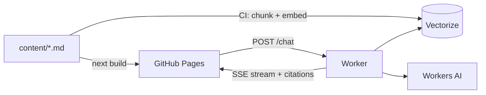

# rst0070.github.io

Personal notes and portfolio, published at [rst0070.github.io](https://rst0070.github.io/),
with a chat assistant that answers questions from the site's own content and cites the
notes it used.

- **The site is static.** Next.js exports plain HTML at build time and GitHub Pages serves it.
- **The assistant is one Cloudflare Worker** on the Free plan: Workers AI for embeddings and
  chat, Vectorize for the search index. No database, no sessions. The browser holds the
  conversation and sends it back every turn.
- **CI keeps the index in step with the markdown.** Push a note, and only that note is
  re-embedded. Delete or unpublish one, and its chunks are pruned.



## Repository map

```text
content/                 # the writing: notes/<yy>/<mm-dd-slug>.md and portfolio.md
apps/
├── web/                 # Next.js site, static export, renders content/ and hosts the chat widget
└── ai-backend/          # Cloudflare Worker: /chat (RAG over the notes) and /admin/reindex
packages/
└── content/             # note types, slug rules and loaders shared by the site and the Worker
docs/                    # explainers and guides (start with ai-chat.md)
.github/workflows/       # deploy-web.yaml builds and publishes the site; ai-backend.yaml deploys the Worker and reindexes
```

## Quick start

Node 24 and pnpm 11 (the version is pinned in `package.json`, so `corepack enable` is enough).

```sh
pnpm install
pnpm dev            # the site at http://localhost:3000, without the chat widget
```

The widget renders only when it knows where the Worker is. To run the whole thing locally,
follow [Running the assistant locally](docs/ai-chat.md#running-it-locally). To deploy your
own copy, follow [Make it yours](docs/make-it-yours.md).

## Documentation

| Read this | To learn |
|---|---|
| [docs/ai-chat.md](docs/ai-chat.md) | How the assistant works end to end, what it costs, and the decisions behind it |
| [docs/make-it-yours.md](docs/make-it-yours.md) | Forking the repo: Cloudflare resources, GitHub secrets, and every hardcoded value to replace |
| [docs/writing.md](docs/writing.md) | Writing a note: frontmatter, drafts, slugs, images, and what a push triggers |
| [apps/web/README.md](apps/web/README.md) | The site: features of a note page, the PDF build, environment variables |
| [apps/ai-backend/ARCHITECTURE.md](apps/ai-backend/ARCHITECTURE.md) | The Worker's contract: HTTP API, layer rules, chunking and pruning details |

## License

The code is [MIT](LICENSE). The writing under `content/` and the images under
`apps/web/public/assets/` are © Wonbin Kim and are not covered by it. Fork the code and
bring your own content.
