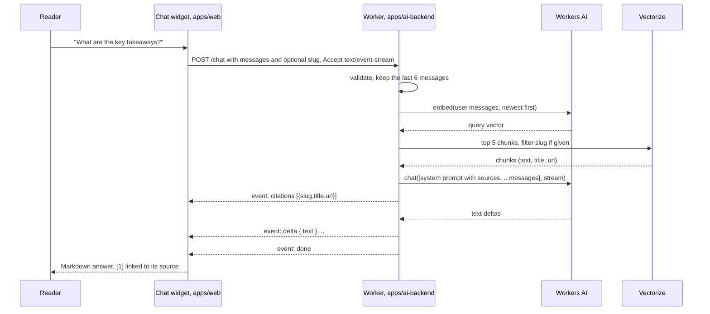

# How the chat assistant works

A reader opens the chat on any page and asks a question. The answer is generated from the
site's own notes and portfolio, streams in as it is written, and ends with links to the
notes it came from. This page shows the whole loop, what it costs, and why it is built this
way. The Worker's exact contract lives in
[apps/ai-backend/ARCHITECTURE.md](../apps/ai-backend/ARCHITECTURE.md).

## One question, end to end



The Worker is stateless. There is no session and no chat history on the server. The
browser sends the conversation so far on every turn, and the Worker retrieves again every
turn.

## Indexing: how the notes get into Vectorize

Chunking and embedding happen in CI, not in the Worker, because the Free plan's CPU limit
per request is too small for it.

```text
push to main
  .github/workflows/ai-backend.yaml
    changes            # classify the diff: worker changed? which content changed?
    deploy             # wrangler deploy, only if apps/ai-backend changed
    index
      changed-files.sh                     # the push's content paths
      pnpm reindex --paths-from changed.txt
        chunkNote / chunkPortfolio         # core/service/chunking.ts, in Node
        POST /admin/reindex/prune          # drop chunks the document no longer has
        POST /admin/reindex                # Worker embeds and upserts, 50 chunks a request
```

A note is split at headings once a chunk is big enough, code blocks are never split, and
each chunk starts with `title > heading path` so the model knows where a passage sits:

```text
chunk(note)
  for each block in markdown
    if block is a fenced code block
      append whole block, never split
    else if block is a heading and chunk has >= 300 tokens
      close chunk, start a new one
    else if chunk would exceed 500 tokens
      close chunk, carry the last ~60 tokens of sentences into the next one
  prefix every chunk with "title > h1 > h2"
  cap text at 8000 UTF-8 bytes (Vectorize metadata limit)
```

Vectorize cannot list an index, so pruning works by probing. A chunk's ID is derived from
`(slug, index)`, and the indexer tells the Worker how many chunks each document has now:

```text
prune(slug, keep)
  stale = []
  for from = keep; from < 512; from += 16
    ids = [id(slug, from) .. id(slug, from + 16)]
    found = vectorize.getByIds(ids)
    if found is empty: break
    stale += found
  deleteByIds(stale)
```

A deleted, renamed, or `_`-prefixed (draft) note arrives as `keep: 0`, which removes it.

## The prompt

Retrieved sources go into the single system message. The reader's messages reach the model
unchanged.

```text
You answer questions about rst0070.github.io, the personal site of Wonbin Kim ...

Rules:
- Answer only from the sources below. If they do not cover the question, say so.
- Reply in the language of the user's latest message.
- Cite sources by number in square brackets, like [1].
- Keep answers concise.
- The reader is on the page "<title>" (<url>), source [n].   # only when scoped to a page

Sources:

[1] <note title> (/notes/<slug>)
<chunk text>

<chunk text>

---

[2] ...
```

Citations are one per note, in rank order, and `[n]` in the answer is citation `n - 1`.
The widget turns each marker into a link.

## The widget

```tsx
<RootLayout> (apps/web/src/app/layout.tsx)
  <ChatWidget> (apps/web/src/app/_chat/chat-widget.tsx)
    usePathname() -> pageSlugFromPath()      # /notes/<slug> or /portfolio, else undefined
    useChat(API_URL, slug)                   # turns held here so they survive navigation
    <ChatPanel> (lazy, loaded on first open)
      scope switch: "This page" | "Whole site"
      <ReactMarkdown> with citation markers linked
      <ol aria-label="Sources">
```

Scope follows the page. On a note, retrieval is filtered to that note and the prompt names
it, so "this post" means what the reader expects:

```text
on navigation
  if the chat is empty: nothing to do
  if it was site-wide: pin scope to "site", keep the conversation
  if it was about a page: reset, the new page is a new conversation
```

The widget is not rendered at all unless `NEXT_PUBLIC_AI_API_URL` was set at build time,
so a checkout without a Worker still builds a working site.

## What it costs and where the limits are

Everything runs on Cloudflare's Free plan.

| Limit | Value | Where it is set |
|---|---|---|
| Requests per reader | 5 a minute per IP | `ratelimits` in `wrangler.jsonc` |
| Messages the model sees | last 6 | `CHAT_POLICY.contextWindow` |
| Chunks retrieved | 5 | `CHAT_POLICY.topK` |
| Chunk size | 300 to 500 tokens, 60 overlap | `CHUNKING_POLICY` |
| Hard ceiling | Workers AI daily Neuron allowance | Cloudflare, not configurable |

The rate limit is a brake, not a quota. It is counted per Cloudflare location and is
eventually consistent. When the daily allowance is gone the Worker answers
`quota-exhausted` and the widget says so.

Models are named in one place, `apps/ai-backend/src/modelCatalog.ts`:

| Role | Model | Note |
|---|---|---|
| Embedding | `@cf/baai/bge-m3` | 1024 dimensions, multilingual. Changing it means recreating the index. |
| Chat | `@cf/openai/gpt-oss-20b` | `reasoning_effort: low`. Reasoning tokens count against `maxTokens`. |

## Why it is built this way

- **The site stays static.** No server renders pages, so hosting is free and the only
  moving part is one Worker that can fail without taking the site down.
- **The client holds the history.** No store to run, nothing to expire, no personal data
  at rest. The Worker keeps only the last six messages anyway.
- **Chunking runs in CI.** The Free plan's CPU budget per request is small. Chunking a
  whole corpus is a batch job, so it runs where batch jobs are cheap.
- **Retrieval happens every turn.** It costs one embedding call and keeps the Worker
  stateless. Sending citations back and forth would save nothing.
- **Chunks carry their heading path.** A passage that says "Constraint > Context window"
  answers better than the same passage bare.
- **Pruning by probing.** It looks odd, but it is the only way to follow deletions on an
  index that cannot be listed, and it never races the same run's writes because prune
  always happens before upsert.
- **Everything Cloudflare-specific is behind an interface.** `src/core` is plain
  TypeScript with no `fetch`, no `crypto`, no `console`. ESLint and a second `tsconfig`
  enforce it, so the retrieval logic is unit-tested with fakes and could move to another
  runtime.

## Where to look

```text
apps/ai-backend/src/
├── index.ts                 # Worker entry: env -> container -> router
├── modelCatalog.ts          # the two model ids
├── core/
│   ├── config.ts            # CHAT_POLICY, LLM_PRESETS, CHUNKING_POLICY
│   ├── usecase/chat.ts      # the turn: validate, window, retrieve, prompt, stream
│   ├── usecase/reindex.ts   # embed + upsert, prune
│   └── service/             # prompt.ts, citation.ts, chunking.ts
├── adapter/                 # Workers AI embedding and chat
├── repositories/            # Vectorize, including the probe-based prune
└── http/                    # routes, auth, CORS, rate limit, SSE
apps/ai-backend/script/
├── reindex.ts               # the indexer CI runs
└── ask.ts                   # run a question file against /chat, for eval
apps/web/src/app/_chat/      # the widget
```

## Running it locally

Once, create the Vectorize index and its metadata index (see
[make-it-yours.md](make-it-yours.md#2-create-the-cloudflare-resources)) and copy
`apps/ai-backend/.dev.vars.example` to `.dev.vars`.

```sh
# terminal 1: the Worker, against the real Workers AI and Vectorize
pnpm --filter @rst0070/ai-backend dev

# terminal 2: fill the index, then the site with the widget pointed at the Worker
pnpm --filter @rst0070/ai-backend reindex
NEXT_PUBLIC_AI_API_URL=http://localhost:8787 pnpm --filter @rst0070/web dev
```

To judge answers without the UI, write a question file and run it:

```sh
pnpm --filter @rst0070/ai-backend ask script/questions.example.json > answers.md
```

`wrangler dev` spends the same daily Neurons as production, and new vectors take a few
seconds to become searchable.
