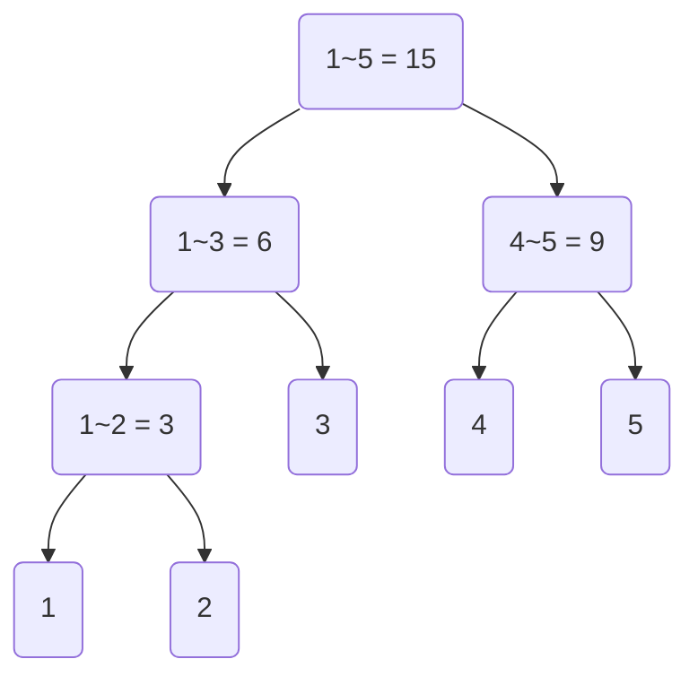

1. [세그먼트 트리의 개념](#1-세그먼트-트리-개념)
2. [세그먼트 트리 구현](#2-세그먼트-트리-구현)
3. [구간합 구하기](#3-구간합-구하기)
4. [특정 원소 변경하기](#4-원소-변경하기)
5. [문제에 적용](#5-문제에-적용)
  
- - -
## 1. 세그먼트 트리 개념
N의 길이를 가진 배열에서 특정 구간의 합을 구하려고 한다면, 또 특정 원소를 빈번하게 변경시켜도 구간의 합을 구하려 한다면 일일이 원소를 더하는 방법은 굉장히 시간이 오래 걸리는 방법이다.  
  
이러한 연산을 빠르게 할 수 있도록 도와주는 자료구조가 세그먼트 트리이다.  
세그먼트 트리는 구간합 이라는 개념을 트리의 계층구조로 표현하여 각각의 노드가 구간의 합을 저장하도록 한다.

예를들어 1부터 5까지의 숫자에 대한 세그먼트 트리는 다음과 같을 것이다.
<div className="mermaid"></div>


선형적으로 구간합을 구해야한다면 특정원소가 변경되었을때 추가적으로 수행해야하는 연산의 수가 많지만, 세그먼트 트리는 해당 원소를 포함하는 구간의 노드만 수정하면 된다.  
  
- - -
## 2. 세그먼트 트리 구현
재귀적인 방법으로 구현하는것이 간단하다. 루트 노드를 1번으로 하고, 부모노드의 번호를 n이라한다면 왼쪽 절반의 부분합은 `n*2`번 노드가 처리하고, 오른쪽 부분합은 `n*2 + 1`번 노드가 처리하도록 한다.  
``` java
int[] arr;//원소들의 순서에 따라 값이 저장되어있는 배열
int[] tree;//

int segmentTree(int head, int tail, int node){
    if(head > tail) return 0;
    if(head == tail) return tree[node] = arr[head];
    int mid = (head + tail) / 2;
    return tree[node] = (
        segmentTree(head, mid, node * 2) + 
        segmentTree(mid + 1, tail, node * 2 + 1)
        );
}
```
원소의 개수가 n일때 트리의 노드개수 는 `n + n/2 + n/4 + n/8 + .....`이다.  
어림잡아 `2*n`이라고 할 수 있는데, 실제 트리를 저장할 배열은 더 큰 크기를 할당해주어야한다.  
왜냐면 트리 노드의 번호 배정이 딱 맞아 떨어지지 않는 경우가 있기 때문이다.  

예를들어 1부터 6까지의 합을 구하는 세그먼트 트리는 다음과 같다.  
<div class="mermaid">
graph TD;
    1(node1: 1 to 6);
    2(node2: 1 to 3);
    3(node3: 4 to 6);
    4(node4: 1 to 2);
    5(node5: 3);
    6(node6: 4 to 5);
    7(node7: 6);
    8(node8: 1);
    9(node9: 2);
    12(node12: 4);
    13(node13: 5);
    1 --> 2 & 3;
    2 --> 4 & 5;
    3 --> 6 & 7;
    4 --> 8 & 9;
    6 --> 12 & 13;
</div>
이와 같이 노드의 실제 개수보다 더 크게 노드번호를 할당하기 때문에 `원소*4`정도의 넉넉한 크기로 트리의 공간을 할당한다.  
  
- - -
## 3. 구간합 구하기
재귀적인 방법으로 구간을 찾으면 된다. 
이때 노드가 담당하고 있는 범위를 저장하지 않아도 재귀적으로 찾을 수 있도록 노드의 범위를 인자로 넘겨주면 된다. 
```java
/**
 * head ~ tail - 노드가 담당하는 구간
 * node - 노드 번호
 * scopeStart ~ scopeEnd - 구하고자 하는 구간
 */
int find(int head, int tail, int node, int scopeStart, int scopeEnd){
    if(head > tail || scopeEnd < head || tail < scopeStart) return 0;//0은 합에 영향을 주지 않는다.
    if(scopeStart <= head && tail <= scopeEnd) return tree[node];
    int mid = (head + tail) / 2;
    return find(head, mid, node*2, scopeStart, scopeEnd) + find(mid + 1, tail, node*2 + 1, scopeStart, scopeEnd);
}
```
- - -
## 4. 원소 변경하기
다른 방법들 처럼 재귀적으로 구현
```java
/**
 * head~tail - node가 담당하는 구간
 * node - 노드 번호
 * val - 변경하고자 하는 값
 * p - 변경하고자 하는 원소의 위치
 */
int change(int head, int tail, int node, int val, int p){
    if(head > tail || p < head || p > tail) return 0;//0은 합에 영향을 주지 않는다.
    if(head == tail){
        //head == tail == p 인 경우
        arr[p] = val;
        return tree[node] = arr[p];
    }
    int mid = (head + tail) / 2;
    return tree[node] = change(head, mid, node*2, scopeStart, scopeEnd) + change(mid + 1, tail, node*2 + 1, scopeStart, scopeEnd);
}
```  
  
- - -
## 5. 문제에 적용
```java
import java.io.*;
import java.util.*;

public class 구간_합_구하기{

    static int N, O;
    static long[] tree = new long[4000001];
    static long[] arr = new long[1000001];
    public static void main(String[] args) throws Exception{
        BufferedReader br = new BufferedReader(new InputStreamReader(System.in));
        BufferedWriter bw = new BufferedWriter(new OutputStreamWriter(System.out));
        StringTokenizer st = new StringTokenizer(br.readLine());

        N = Integer.parseInt(st.nextToken());
        O = Integer.parseInt(st.nextToken()) + Integer.parseInt(st.nextToken());

        for(int i = 1; i <= N; i++)
            arr[i] = Long.parseLong(br.readLine());

        makeTree(1, N, 1);

        while(O-- > 0){
            st = new StringTokenizer(br.readLine());
            int a = Integer.parseInt(st.nextToken());
            int b = Integer.parseInt(st.nextToken());
            Long c = Long.parseLong(st.nextToken());

            if(a == 1){
                arr[b] = c;
                change(1, N, 1, b);
            }else{
                bw.write(getSum(1, N, b, c.intValue(), 1) + "\n");
            }
        }
        bw.flush();
    }

    static long makeTree(int head, int tail, int node){
        if(head > tail) return 0;
        if(head == tail)    return tree[node] = arr[head];

        int mid = (head + tail) / 2;
        return tree[node] = (makeTree(head, mid, node * 2) + makeTree(mid + 1, tail, node*2 + 1));
    }

    static long getSum(int head, int tail, int scopeS, int scopeE, int node){
        if(scopeE < head || scopeS > tail) return 0;
        if(scopeS <= head && tail <= scopeE) return tree[node];
        int mid = (head + tail) / 2;
        return getSum(head, mid, scopeS, scopeE, node*2) + getSum(mid + 1, tail, scopeS, scopeE, node*2 + 1);
    }

    static long change(int head, int tail, int node, int pos){
        if(pos < head || tail < pos) return tree[node];
        if(head == tail) return tree[node] = arr[head];
        int mid = (head + tail) / 2;
        return tree[node] = (change(head, mid, node * 2, pos) + change(mid + 1, tail, node*2 + 1, pos));
    }
}
```