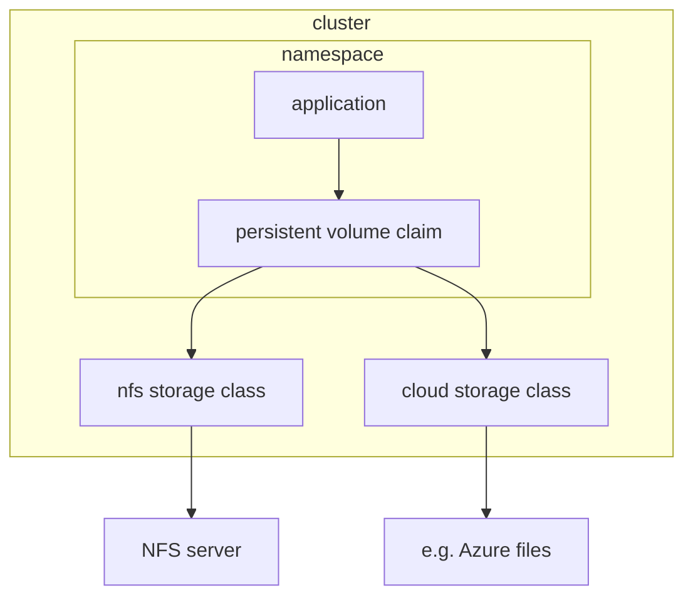

I tried to connect nfs, which is provided by nas, to k3s cluster, and now I'm going to note of that journey.  
  
0. The goal
1. Set up nfs server in _iptime nas_  
2. Concept of storage class, persistent volume, and persistent volume claim
3. Build nfs storage class: installing driver, defining manifest file

# 0. The goal
I've been studying kubernetes and deployed some oss on my own cluster without knowing concept of volumes in kubernetes.  
and I watched [youtube video](https://youtu.be/0swOh5C3OVM?si=ZftjC_XU3d14vv69) explaining what it is, and decided to use storage class to connect persistent volumes to apps on my cluster.  
  
# 1. Set up nfs server in _iptime nas_  
[ref](https://shonm.tistory.com/766)  
```bash
/opt/sbin/portmap
/opt/sbin/unfsd -e /opt/etc/exports 
```

# 2. Concept of volumes in kubernetes

`pod -> persistent volume claim -> persistent volume`  
  
- persistent volume: cluster-wide concept
- persistent volume claim: concept in namespace
  
If we use pure persistent volume, we need to set one persistent volume per one persistent volume claim. So it needs to be 1:1 mapping.  
  
However, `Storage Class` does mapping automatically.  
  
# 3. NFS Storage class

## 3.1. NFS driver
Need to install kubernetes Container Storage Interface (CSI) first, [github](https://github.com/kubernetes-csi/csi-driver-nfs#readme).  
  
1. Add helm repo
```bash
helm repo add csi-driver-nfs https://raw.githubusercontent.com/kubernetes-csi/csi-driver-nfs/master/charts
```
  

2. Install with specific version
```bash

```

  
nfs storage class
checkout parameters for the provisioner [here](https://github.com/kubernetes-csi/csi-driver-nfs/blob/master/docs/driver-parameters.md)  
```yaml
apiVersion: storage.k8s.io/v1
kind: StorageClass
metadata:
  name: example-nfs
provisioner: example.com/external-nfs
parameters:
  server: nfs-server.example.com
  path: /share
  readOnly: "false"

```

3. ERRORRRRRRR
I got following at the first time:  
```bash
Warning  ProvisioningFailed    1s                 nfs.csi.k8s.io_agent-00_b97d6068-d50e-4296-b946-78e305338f70  failed to provision volume with StorageClass "iptime-nas-nfs": rpc error: code = Internal desc = failed to mount nfs server: rpc error: code = Internal desc = mount failed: exit status 32
```
and found stackoverflow [post](https://stackoverflow.com/questions/34113569/kubernetes-nfs-volume-mount-fail-with-exit-status-32).
Need to install `nfs-common` to every k3s node.  

# 4. Change default storage class
Usually if you don't specifiy storage class to be used in a persistent volume claim, it uses default storage class. 
In my case, it was like follows:  
  
```bash
rst@Wonbinui-MacBookPro ~ % kubectl get storageclass
NAME                   PROVISIONER             RECLAIMPOLICY   VOLUMEBINDINGMODE      ALLOWVOLUMEEXPANSION   AGE
iptime-nas-nfs         nfs.csi.k8s.io          Delete          Immediate              false                  3h45m
local-path (default)   rancher.io/local-path   Delete          WaitForFirstConsumer   false  
```

I changed the default storage class because its hard find all helm chart's pvc.  
  
The first thing we need to do is marking default storage class as non-default. 
In my case, It would be like
```bash
kubectl patch storageclass local-path -p '{"metadata": {"annotations":{"storageclass.kubernetes.io/is-default-class":"false"}}}'
```  
  
The second thing is marking the storage class you want as default storage class
```bash
kubectl patch storageclass iptime-nas-nfs -p '{"metadata": {"annotations":{"storageclass.kubernetes.io/is-default-class":"true"}}}'
```

Now you can see like
```bash
rst@Wonbinui-MacBookPro ~ % kubectl get storageclass  
NAME                       PROVISIONER             RECLAIMPOLICY   VOLUMEBINDINGMODE      ALLOWVOLUMEEXPANSION   AGE
iptime-nas-nfs (default)   nfs.csi.k8s.io          Delete          Immediate              false                  3h49m
local-path                 rancher.io/local-path   Delete          WaitForFirstConsumer   false                  13d
```