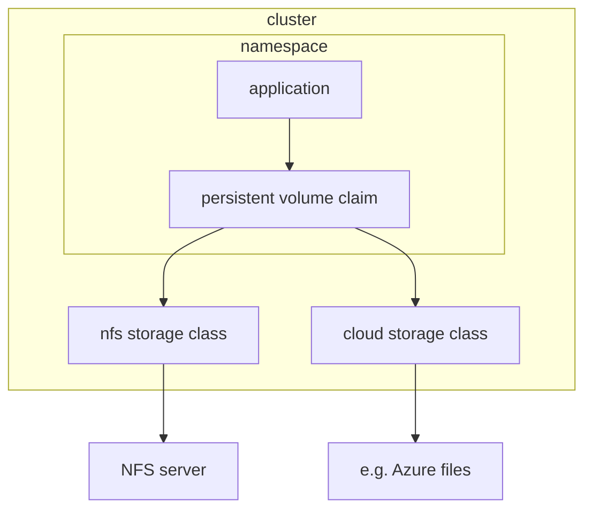

I tried to connect nfs, which is provided by nas, to k3s cluster, and now I'm going to note of that journey.  
  
0. The goal
1. Set up nfs server in _iptime nas_  
2. Concept of storage class, persistent volume, and persistent volume claim
3. Build nfs storage class: installing driver, defining manifest file

# 0. The goal
I've been studying kubernetes and deployed some oss on my own cluster without knowing concept of volumes in kubernetes.  
and I watched [youtube video](https://youtu.be/0swOh5C3OVM?si=ZftjC_XU3d14vv69) explaining what it is, and decided to use storage class to connect persistent volumes to apps on my cluster.  
  
# 1. Set up nfs server in _iptime nas_  
[ref](https://shonm.tistory.com/766)  

# 2. Concept of volumes in kubernetes

`pod -> persistent volume claim -> persistent volume`  
  
- persistent volume: cluster-wide concept
- persistent volume claim: concept in namespace
  
If we use pure persistent volume, we need to set one persistent volume per one persistent volume claim. So it needs to be 1:1 mapping.  
  
However, `Storage Class` does mapping automatically.  
  
# 3. NFS Storage class

## 3.1. NFS driver
Need to install kubernetes Container Storage Interface (CSI) first, [github](https://github.com/kubernetes-csi/csi-driver-nfs#readme).  
  
1. Add helm repo
```bash
helm repo add csi-driver-nfs https://raw.githubusercontent.com/kubernetes-csi/csi-driver-nfs/master/charts
```
  

2. Install with specific version
```bash

```

  
nfs storage class
```yaml
apiVersion: storage.k8s.io/v1
kind: StorageClass
metadata:
  name: example-nfs
provisioner: example.com/external-nfs
parameters:
  server: nfs-server.example.com
  path: /share
  readOnly: "false"

```