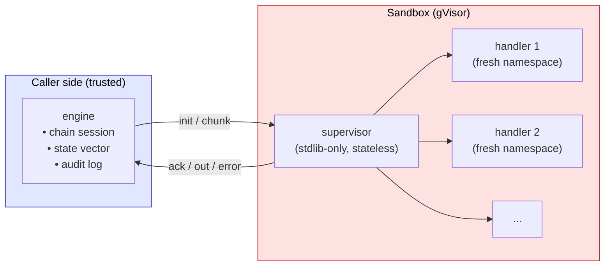

## 1. Shape of Goal
```mermaid
flowchart LR
    User(((User)))

    subgraph InputChain["input hook chain"]
      direction LR
      I1["hook 1"]
      I2["hook 2"]
      Idots["..."]
      In["hook n"]
      I1 -->|pass / modify| I2
      I2 -->|pass / modify| Idots
      Idots -->|pass / modify| In
    end

    Agent["AI Agent"]

    subgraph OutputChain["output hook chain"]
      direction LR
      O1["hook 1"]
      O2["hook 2"]
      Odots["..."]
      Om["hook m"]
      O1 -->|pass / modify| O2
      O2 -->|pass / modify| Odots
      Odots -->|pass / modify| Om
    end

    UserOut(((User)))

    User -->|message| I1
    In -->|pass / modify| Agent
    InputChain -.->|any hook returns `block` / `skip`| UserOut
    Agent -->|reply (streaming or final)| O1
    Om -->|pass / modify| UserOut
    OutputChain -.->|any hook returns block| UserOut

    classDef hook fill:#fef3c7,stroke:#d97706,color:#000
    classDef actor fill:#e0e7ff,stroke:#4338ca,color:#000
    classDef chain fill:#fffbeb,stroke:#d97706,color:#000
    class I1,I2,Idots,In,O1,O2,Odots,Om hook
    class Agent actor
    class InputChain,OutputChain chain
```
The goal is a hook system that sits between the user and the AI agent, so arbitrary custom logic can run as middleware on every message — on the user's input, and on the agent's reply (including while it streams).  
  
My first instinct was to ship hooks as git-tracked Python: each hook a function in the repo, the chain a list of imports, new behavior shipped via deploy. That works when the set of hooks is small and stable.  
  
The real requirement is closer to one new custom hook every week — different per customer, written by people who aren't engineer, and changing often.  
  
So I finally made decision the hook code to live in the database and runs in a containerized sandbox, one container per trigger point.  
Everything below is the design that falls out of that constraint.

## 2. What I was concerned about
A few concerns kept coming back. Each one led me to a specific seam in the design.
  
- **Untrusted code, but it still needs to interact with the caller side.**
  Hooks are written per-customer by non-engineers, shipped through Admin. 
  They need some context (e.g. message text, IDs, maybe internal fields like credit balance), and they also need to act on the caller (e.g. message modification, credit consumption), but they shouldn't have direct access to internal data.
  
  This led me toward a hard trust boundary — gVisor + stdlib-only inside — with a narrow JSON-formatted protocol as the only integration surface.
  
  
- **Hooks in the same chain belong to different authors.**
  Globals, imports, `/tmp`, background processes — none of these should leak between hooks even when they share a container. 
  Leaned toward a fresh namespace per hook handler at chain init, with caller-side state threading (`state[i]` echoed back per call). 
  The chain runner inside the container stays stateless; the trusted side carries the state vector.
  
  
- **Streaming pulls in two directions.**
  Needs to feel real-time *and* not flash unredacted PII before the redaction logic sees it. 
  A naive per-chunk redactor also breaks on patterns that cross chunk boundaries (e.g. `"phone: 010-"` then `"1234-5678"`). 
    
  Best option for the situation felt like a sliding-window state per hook threaded across chunks, plus running the chain twice — once on the live stream (UX overlay), once on the assembled raw reply (authoritative for persistence). 
  Persistence ends up at worst over-redacted, never under-redacted.


## 3. Architecture

Three zones, one boundary. Each concern from §2 lives on a zone or a crossing between two.



### 3.1 The boundary
One channel between the trusted side and the sandbox: a JSON-formatted protocol on a single sandbox-exec socket. Two message types travel on it.

- `init` — the caller declares the chain: a list of `{handler code, declared action, settings}` entries.
- `chunk` — the caller sends text + the state vector; the sandbox returns `top_action`, outgoing text, per-hook results, and `terminal_index` (if any).

Above the line: the rest of the system. Below the line: stdlib-only Python, no project code, no network unless the image explicitly enables it. gVisor sits under the container as the actual sandbox.

The channel turned out to be more concrete than it looks. Docker exec multiplexes handler stdout, handler stderr, and our protocol over one socket using 8-byte frame headers. The protocol travels on **stderr** so a handler's stray `print()` can't break framing. (See `findings/docker-exec-multiplex.md`.)

### 3.2 Supervisor and handlers
Inside the container, a small stdlib-only **supervisor** walks the chain. It's stateless between calls — everything that needs to persist lives on the caller side.

- On `init`: for each chain entry, `exec` the handler's source into a **fresh namespace** dict, then check that `execute` is callable and that the `declared_action` is one of `{modify, block, skip, detect, pass}`.
- On `chunk`: walk the chain in order. For each handler build `ctx = {…context, outgoing: text, state: state[i]}`, call `execute(ctx, settings)`, validate the returned action is either the declared one or `pass`, thread modified `outgoing` forward to the next handler.
- Terminal actions (`block`, `skip`) stop the walk; the supervisor reports `terminal_index` back.

The `declared_action` check is the other half of the trust story. The boundary keeps a handler from reaching internals; the declared action keeps it from doing more than its catalog row promised.

### 3.3 The state vector
Per-hook state lives in `state[i]`, one slot per chain position. The caller sends the full vector on every chunk; the supervisor echoes back each ran-hook's new state inside `hooks_ran`; the caller updates `state[i]` for the next call.

Effects:
- Sandbox stores nothing across calls.
- Hook B cannot read Hook A's state — different slots, different namespaces.
- A sliding-window redactor (the §2 PII case) keeps its window inside `state[i]`. The caller threads it transparently; the boundary doesn't need to know it exists.

### 3.4 Streaming with two paths
Output streaming runs the same chain against two paths:

- **Stream path** — the caller's streaming wrapper buffers chunks up to a flush threshold, sends the buffer through the chain, then commits all but a lookback tail of the result. The tail becomes the next batch's prefix, so a pattern split across two chunks (e.g. `"phone: 010-"` then `"1234-5678"`) is still seen as one piece. The boundary-crossing problem from §2 is solved here, at the buffering layer.
- **Final path** — once the model finishes, the chain runs once more against the assembled raw reply. This run is the source of truth for persistence.

The stream path is the UX overlay; the final path is what gets saved. They diverge at most by over-redaction, never under-redaction.

## 4. Technical findings or considerations

### 4.1 Docker exec is one socket, three streams

`docker exec` doesn't give you separate sockets for stdin / stdout / stderr. It gives you one TCP connection (hijacked from HTTP/1.1) carrying all three, multiplexed by an 8-byte frame header per chunk:

```
\x{stream}\x00\x00\x00\x{size: 4 bytes, big-endian} <payload bytes>
stream: 0=stdin, 1=stdout, 2=stderr
```

So `{"type":"ack"}\n` (14 bytes) arrives on the wire as 22 bytes: `\x01\x00\x00\x00\x00\x00\x00\x0E` + the JSON.

When `tty=False`, the client has to demultiplex itself — read 8 bytes, unpack `>BxxxL`, then keep only the payloads from the stream you care about.

Two choices fell out of this once I knew the shape:

- **Protocol on stderr, not stdout.** A handler's stray `print()` then lands on stdout and is discarded by the demuxer — the protocol stays clean for free.
- **One demux loop is the whole client side.** No threads, no separate readers per stream; the 8-byte header is enough to route every chunk to the right place.

### 4.2 Three concerns on Isolation

"Isolation" sounded like one concern, but while designing I found it split into three:

| Concern | What it means | What handles it |
|---|---|---|
| **Runtime security** | Hook code can't escape the container to the host | gVisor sandbox |
| **Code-to-code** | Hook B doesn't see what Hook A left behind — globals, imports, `/tmp`, processes | Fresh namespace per handler; one container per trigger-point chain |
| **Resource** | One runaway hook can't eat the whole pool | cgroups + pool ceiling |
  
I first wanted one container per hook for code-to-code, but it was too expensive. I settled on one container per trigger-point chain — fine because a chain always runs for the same target, so I let that bar sit lower.  
  
Two layers fell out:

- **Per handler — fresh namespace inside the same container.** The supervisor `exec`s each handler's source into a new `dict`. Enough to stop globals, imports, and class state from leaking between hooks.
- **Per trigger point — fresh container.** Bounds anything upstream left behind (open FDs, background processes, modified `/tmp`) without paying container-start cost per hook.
