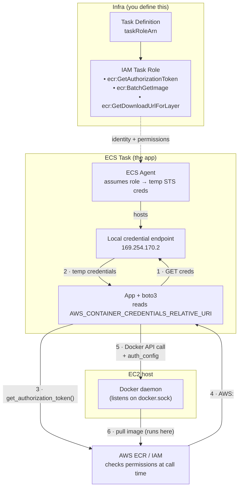

I faced an error like the following while an application on ECS runs the docker daemon on EC2 to pull an ECR image:

```
Internal Server Error ("failed to resolve reference "----.dkr.ecr.ap-northeast-1.amazonaws.com/----:----": pull access denied, repository does not exist or may require authorization: authorization failed: no basic auth credentials")
```

I tried to understand how the authentication process works on AWS, and what would be a good enough way to use it in a secure way.

This note lays out the concept of it, including test code that I wrote to mimic what's going on behind the AWS infra from the application's perspective.

## How it works

Condition:

- App runs on ECS
- The app runs docker api which triggers docker pull operation on EC2 instance

Principles I followed:

- EC2 should not know about the permission problem
- Infra should handle credential things -- not application business logic


No static keys live in the container. The **task IAM role** is just an *identity* — it doesn't hold credentials. ECS generates **temporary credentials for that role** and exposes them via a local endpoint; the app fetches them automatically:




1. Infra defines the identity and the permissions. The task definition assigns a `taskRoleArn`. That role's policy grants `ecr:GetAuthorizationToken` (Resource `*`) and the pull actions scoped to the repo (`ecr:BatchGetImage`, `ecr:GetDownloadUrlForLayer`).
2. ECS injects the endpoint. Because the task has a role, the ECS agent runs a local credential endpoint at `169.254.170.2` and sets `AWS_CONTAINER_CREDENTIALS_RELATIVE_URI` in the container.
3. boto3 just fetches the credential. It reads that env var, sends a GET to the endpoint, and gets back temporary STS credentials. There is no assume-role call and no login. It is just a fetch.
4. The token authenticates Docker. boto3 calls `get_authorization_token`, gets back `AWS:<password>`, and hands it to the Docker daemon as `auth_config`. Then the daemon pulls the image.


One thing confused me: there are two different tokens, and they are not the same.  
  
The local endpoint (`169.254.170.2`) gives back IAM/STS credentials (`AccessKeyId`, `SecretAccessKey`, `SessionToken`). 
These only prove who the task is. They are not the Docker login token. The ECR authorization token (`AWS:<password>`) is a separate thing. 
It comes from the `get_authorization_token` API call, which you sign using the IAM credentials above. 
So the endpoint gives the identity, and the ECR API gives the registry password.

This also means the permissions are checked at two places, not at the endpoint fetch. 
`ecr:GetAuthorizationToken` is checked at the API call in step 4, and `ecr:BatchGetImage` / `ecr:GetDownloadUrlForLayer` are checked later when the daemon actually pulls. 
boto3 also fetches the endpoint credentials lazily, on the first signed request, not when you call `boto3.client()`.

So the responsibility is split. Infra owns who the task is and what it can do. boto3 only fetches the credential. IAM checks the permissions at call time. That is why a missing permission fails late, as `no basic auth credentials` or `AccessDenied`.

## Test code

1. Save credential

With AWS SSO login, run the following command to save the credential info:

```bash
aws configure export-credentials --profile myprofile > /tmp/creds.json
```

2. Run mock credential server

```python
import json, http.server
c = json.load(open('/tmp/creds.json'))
body = json.dumps({
    "AccessKeyId": c["AccessKeyId"],
    "SecretAccessKey": c["SecretAccessKey"],
    "Token": c["SessionToken"],
    "Expiration": c["Expiration"],
}).encode()
class H(http.server.BaseHTTPRequestHandler):
    def do_GET(self):
        self.send_response(200); self.send_header("Content-Type", "application/json")
        self.end_headers(); self.wfile.write(body)
http.server.HTTPServer(("127.0.0.1", 8089), H).serve_forever()
```

3. Test script

```python
import boto3
import base64
import os

os.environ['AWS_CONTAINER_CREDENTIALS_FULL_URI'] = 'http://127.0.0.1:8089/creds'
os.environ['AWS_DEFAULT_REGION'] = 'ap-northeast-1'

client = boto3.client(
    'ecr'
)

response = client.get_authorization_token()
token = response['authorizationData'][0]['authorizationToken']

username, _, password = base64.b64decode(token).decode('utf-8').partition(':')

import docker
docker_client = docker.DockerClient(
    base_url="unix:///Users/my-account/.colima/default/docker.sock",
    # I'm using colima
)

image = docker_client.images.pull(
    '----.dkr.ecr.ap-northeast-1.amazonaws.com/----',
    tag='----',
    platform='linux/amd64',
    auth_config={
        'username': username,
        'password': password,
    },
)

print(image)
```

## Open question

Actually, I don't like the part where the application code specifies `ecr`. With better code architecture we can improve it (such as separating the business logic from the infra-related part), but I still ask myself: "what if we don't know what kind of docker repository we are looking at?"