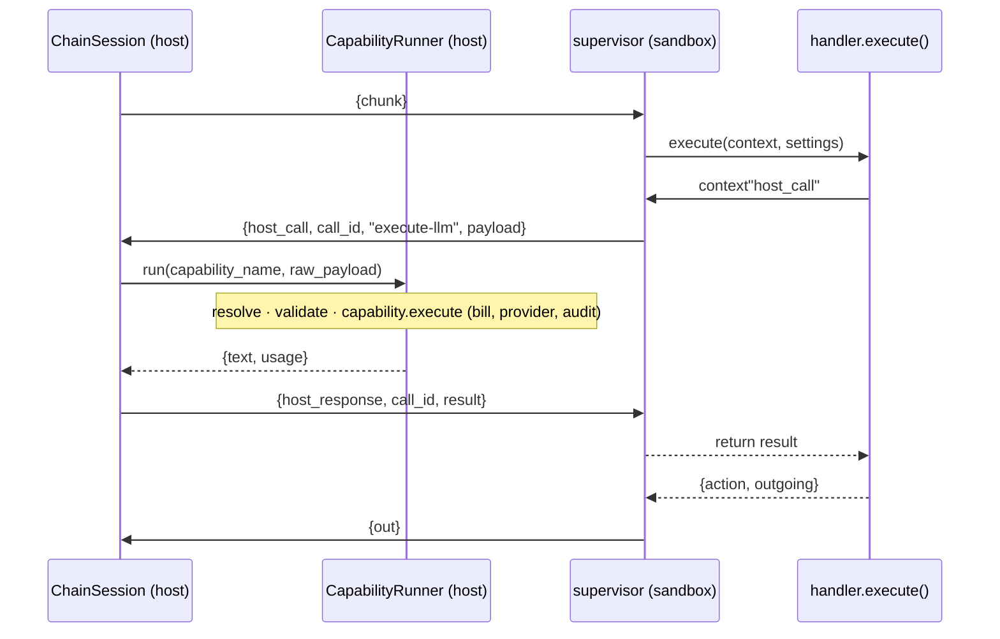

This is design record of RPC protocol based on `05-29-middleware-of-ai-agent.md`.  

## Background
I designed "middleware architecture for ai agent" at `05-29-middleware-of-ai-agent.md`.  
The middleware system executes custom hook logic between user and agent interaction such as PII redaction, preventing system prompt hacking.    

Each hook logic runs on sandbox environment with special protocol for communicate with application code.

based on that I had to enhance the architecture to handle the dynamic logic's functionalities, such as LLM calling, or running existing logic in the host application code.  
  
So I designed RPC protocol for that: making untrusted code on sandbox to run application side logic.  

In this post, I will record what I was considering, and how I could design the protocol.  

For the detail of the middleware system, please check `05-29-middleware-of-ai-agent.md`.

## Constraint (Requirement)
The untrusted code is a dynamically changing python script. 
Admin of the AI agent platform modifies the code, and normal users utilize the code to apply the hooks on their AI Agent. 

We could just let the dynamic code to handle that specific functionality manually(such as just supporting docker image to be much heavy as possible to support all the specific library), but based on the business logic of the AI agent platform, I believed that there would be better and cleaner solution (keep the dynamic python script as business logic specific, and implementation is concerned at another place).
  
The AI agent platform has tightly coupled logics, and most of the user would expect the dynamic code can be integrated with the platform logics.

And moreover, we have "credit gating logic", which should be hard coded to every main functionalities. 
So for example, If one of the hook want to implement LLM execution feature, it should trigger credit checking and consuming logic written in application code.

duplicating this logic is not a good choice because that credit logic could be changed anytime such as how much will be charged, what database record will be updated.  
  
So finally I decided to leverage the socket connection between sandbox and host application.  

Followig will be the details of how I designed that transmission rule.  
  

__To sum up the reason of this decision:__  
The hook handler (each hook code running on sandbox) needs to call LLM. 
To fullfill this requirement, I made new RPC protocol between hook-handler and application logic because we will gradually get more requirement to integrate existing functionality, and this approach has several benefits.

- keep hook handler simple — define what to do without implementation
- Re-use existing functionalities
- Integrate backend internal logic — especially credit
    - because implementation of functionality is django side, we can use same credit integration pattern as other code does
  

## Overall Architecture

mid-`execute()` round-trip:

```
host → sandbox : {type: "chunk", ...}
   (handler calls context"host_call" inside execute())
sandbox → host : {type: "host_call", call_id, capability: "llm.complete", payload}
host → sandbox : {type: "host_response", call_id, ok, result}   # host bills + calls provider
sandbox → host : {type: "out", ...}                             # or another host_call
```

Because the supervisor is single-threaded and synchronous, this nests cleanly — no
threads, no asyncio, no change to handler validation.


