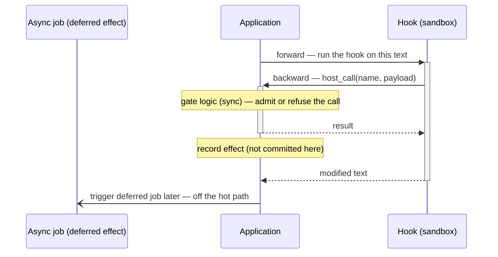

This is a design record of an RPC protocol that extends the middleware system from *[Design of AI Agent Middelware](./26-05-29-middleware-of-ai-agent)*.

## 1. Background
The middleware system runs custom hook logic between the user and the agent — PII redaction, blocking prompt injection, and so on. 
Each hook is a dynamic Python script that runs in a sandbox, and the application drives it through a narrow protocol over one socket.  
  
Concretely, a hook is an `execute` function: it gets the text flowing through the chain (`context`) plus its own `settings`, and returns what to do with that text.

```python
def execute(context, settings):
    text = context["outgoing"]
    return {"action": "modify", "outgoing": text.replace("secret", "***")}
```

So the communication was one way: **the application asks the sandbox to run a hook, and gets the result back.** For the middleware system itself, see *[Design of AI Agent Middelware](./26-05-29-middleware-of-ai-agent)*.

## 2. Reversing the direction

That one-way protocol covers transforming text. 
But hooks also need to *do* things — call an LLM, or reuse logic that already lives in the application. 
And some of that logic is non-negotiable: credit, for example — the platform's usage currency — must be checked and consumed around every billable action, with rules that change often. 
Reimplementing it inside untrusted sandbox code would be both unsafe and a maintenance trap.  
  
So instead of pushing implementation down into the sandbox, I let the sandbox **ask the application** — the same request/response, now running backwards: the hook requests an application function and gets the result.

```python
def execute(context, settings):
    reply = context["outgoing"]
    # say what you want — "run an LLM" — not how it's done
    result = context["host_call"]("llm.run", {"prompt": f"Summarize: {reply}"})
    return {"action": "modify", "outgoing": result["text"]}
```

`host_call(name, payload)` — the hook's one line into the application — is the whole surface a hook author sees.  
The benefits:

- **Simple hooks** — declare what to do, not how
- **Reuse** existing application functionality
- **One integration point** for application conventions like credit — the implementation stays on the application side, using the same patterns as everything else

## 3. Architecture Diagram



- The backward call returns the hook its result immediately, but its side-effect isn't committed inline.  
- The application runs gate logic synchronously (refusing the call if the precondition fails) then records the effect
- **deferred async job** applies the recorded effect. 

The slow / committing work stays off the streaming path, and the sandbox never decides policy: it says *what* to run, the application decides *whether it's allowed* and *what it costs*. 

## 4. Design decisions

Running the protocol backwards raises two questions the forward direction never had.

### 4.1. What can a hook call?

In the forward direction the application knows exactly which hooks exist — it built the chain.  
In reverse, the application can't predict what a hook will ask for.  
So the application doesn't expose a fixed set of functions; 
it exposes a **registry of capabilities**, fronted by one service — the **Capability Runner**.  
  
A capability is one effect the sandbox may ask for, and it declares everything about itself: its `name`, a schema for its payload, which gates apply to it, and an `execute` that returns both its result and what it consumed.  
  
Every `host_call` goes through the runner, which always does the same steps in order: 
- **resolve** the capability by name
- **validate** the payload against its schema
- **gate** with application side constraint
- **execute** capability
- **dispatch** additional work 

Adding a feature is "write a capability and register it" — the protocol and the runner don't change. 
And since the sandbox can only *name* a capability, what untrusted code can do is exactly the registry, nothing more.

### 4.2. How do application conventions stay enforced?

Every application feature carries conventions that must hold no matter who calls it — credit is one of the example. 
Untrusted code must never be able to skip them.
  
That is the **gate**: a precondition the runner checks before `execute`. 
Gates are declared per capability and enforced uniformly in the runner, so each convention lives in one place.  
  
Because the sandbox reaches application effects only through the runner, no gate is skippable.