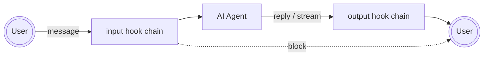
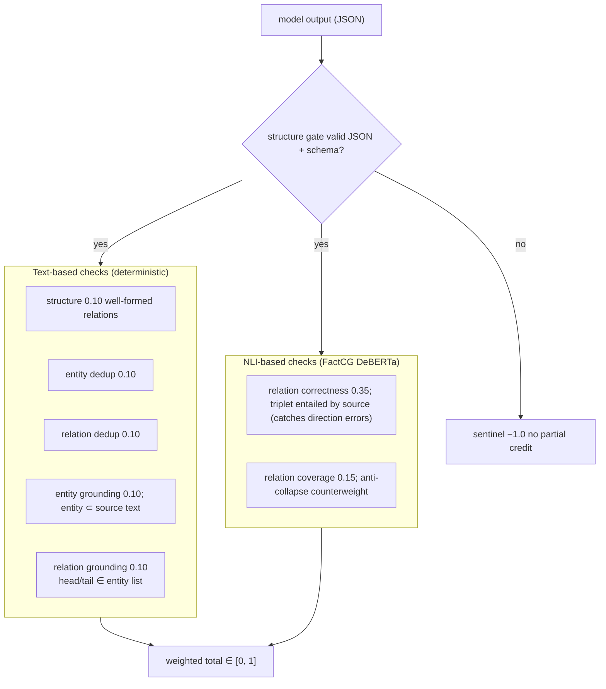
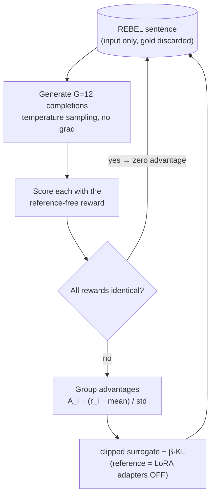

# Wonbin Kim

AI Engineer

Taipei · open to relocation to Singapore

[kwb0711@gmail.com](mailto:kwb0711@gmail.com) · [GitHub](https://github.com/rst0070) · [LinkedIn](https://www.linkedin.com/in/wonbin-kim-7263a7184/) · [HuggingFace](https://huggingface.co/rst0070) · [blog](https://rst0070.github.io/notes)

## Summary

AI Engineer with production experience across the full LLM agent — stack agent orchestration, tool design, sandboxed agent governance (prompt-injection blocking, PII redaction, output moderation), evaluation pipelines, multimodal RAG, and conversation memory. 

Hands-on with RL fine-tuning, knowledge graph, and AWS/Kubernetes infrastructure.

Contributor to Mem0 (Over 58k stars AI memory system)

1st author paper on speaker verification

## Skills

- **LLM / Agents:** LlamaIndex, LangChain, LangGraph, RAG (multimodal), agent tools, MCP-style protocols, vLLM, structured outputs, evaluation (DeepEval)
- **Training / ML:** PyTorch, GRPO, QLoRA, LLM fine-tuning, Speaker Verification
- **Infra:** AWS, GCP, Kubernetes, Docker, Terraform, Airflow, Argo Workflows, Elasticsearch, Redis, Kafka, Neo4J
- **Backend / Full-stack:** Python (Django, FastAPI), React / React Native, TypeScript, Java (Spring)

## Work Experience

### MaiAgent(AI Engineer, 2025.12 - , Taipei)

AI Agent platform for Enterprise [maiagent.ai](https://maiagent.ai/en/about)

Shipped full-stack AI features end-to-end inside an existing Django + LlamaIndex codebase - designing within the constraints of the existing system, across AI pipeline, backend, and frontend.

#### Agent Middleware
<details>
<summary>Sandboxed per-tenant hook layer around the AI agent — 77k executions/week across 10 enterprise orgs</summary>



**Goal:** Every message rule on the platform — "reply in Traditional Chinese", "never mention competitors", PII masking — relied on prompting, which fails ~5% of the time, or on hardcoded backend logic, which can't scale per-customer in multi-tenant SaaS. The goal was a 100% deterministic interception layer before and after the AI agent, where per-tenant rules ship with no deployment.

**Constraint:** The realistic demand was ~one new custom hook per week — per-customer, written by non-engineers, changing often — which rules out git-tracked, deploy-gated code and forces untrusted code onto the hot path of every message. The design had to give that code application context without internal access, isolate hooks from different authors sharing one chain, and stream in real time without ever flashing unredacted PII.

**Approach:** Designed and delivered end-to-end a middleware hook system where hook code lives in the database and executes in a gVisor-sandboxed container — one container per trigger point (input / output streaming / output final), with a JSON protocol over a single docker-exec socket as the only integration surface.

- **Three-layer execution model** — application engine, stdlib-only supervisor, per-hook handlers in fresh namespaces. The sandbox is stateless; the trusted side threads a per-hook state vector, so hooks from different authors can't read each other's state.
- **Reverse-direction RPC** (`host_call`) so hooks can invoke application capabilities (run an LLM, consume credit) through a gated capability registry — the sandbox names an effect, the application decides whether it's allowed and what it costs.
- **Dual-path streaming** — a buffered stream path with a lookback tail catches PII patterns split across chunks in real time, while a final pass over the assembled reply is the source of truth for persistence: at worst over-redacted, never under-redacted.
- **Layered isolation** — runtime security via gVisor, code-to-code isolation via fresh namespaces per handler, resource isolation via cgroups, settling on one container per trigger-point chain after ruling out one container per hook as too expensive.
- **Negotiated-union contract for heterogeneous detection vendors** (one supports ~200 PII categories, another 30): business logic owns a small stable category set, providers declare their own catalogs, and selections are validated at configuration time — so provider churn never touches the business contract.

**Result:**

- **77k hook executions per week** against 28k agent messages per week — **~2.7 hook runs per message**, showing adopters chain multiple hooks and attach them to both input and output paths.
- **10 enterprise organizations** (of 107 active on the platform) run custom hooks in production.
- Zero-deployment delivery in practice: new per-customer hooks ship through admin, not through the release cycle.
  

**Write-ups:**  
Design write-ups with the full thought process:
1. [Overall architecture and the sandbox isolation model](https://rst0070.github.io/notes/26-05-29-middleware-of-ai-agent) — trust boundary, three-layer execution, dual-path streaming
2. [Reverse RPC from sandbox to application](https://rst0070.github.io/notes/26-06-08-rpc-from-sandbox-to-application) — capability registry and gate design
3. [A contract for heterogeneous PII/guardrail vendors](https://rst0070.github.io/notes/26-07-22-contract-heterogeneous-adapters) — how the negotiated-union contract was reached

</details>


#### Multimodal RAG
<details>
<summary>Zero-migration multimodal overlay on the existing RAG pipeline — image ingestion, cross-modal retrieval, and image-grounded answers in 6,534 of 9,026 production knowledge bases</summary>

**Goal:** The requirement arrived as a single abstract sentence — "make our RAG support images" — on a platform whose only image handling was chat attachments: no ingestion, no retrieval, no image-aware generation. I scoped it into a concrete end-to-end contract: knowledge bases ingest images (standalone or embedded in documents), and both the RAG chatbot and the agentic chatbot use them at inference — under the same configuration as text, not a separate mode.  
  
**Constraint:**  
- **Text-only LlamaIndex:** The codebase is deeply coupled to LlamaIndex, and LlamaIndex's core abstractions have no concept of image nodes — the response synthesizer flattens every retrieved node to a text string, rerankers assume text content, and the agent framework returns tool results as text only. Images don't fail loudly anywhere; they get **silently stripped** at each layer. Rewriting the stack was off the table, so every fix had to be a surgical extension of an existing LlamaIndex class.
- **The "same index" mandate:** My first design used a separate Elasticsearch index for image vectors, but the direction was "keep it simple" — image data had to live in the **same index** as text nodes, flow through the same ingestion/deletion/persistence pipeline, and require zero migration.
- **Same configuration, graceful degradation:** Multi-tenant reality: some knowledge bases run non-multimodal embedding models, some chatbots run non-multimodal LLMs, and the platform previously reacted to an image by throwing a hard error or silently switching to a different LLM call path. The feature had to be **one code path** that degrades gracefully — images used when the stack supports them, cleanly skipped when it doesn't — with no per-tenant forks.
  
**Approach:** Introduced multimodal processing as an overlay on the existing text pipeline — at every layer it activates only when images are present and the connected components support them; otherwise the original text path runs unchanged.  
- **Indexing with a small trick:** The same-index mandate constrains retrieval too — the *existing* retriever stack had to serve image results, and LlamaIndex has no image support on that path. So an image is indexed as an ordinary text node carrying a `node_type='image'` tag, with its embedding pre-generated by a multimodal model into the shared vector space. Existing indexing, retrieval, and deletion logic runs unmodified; downstream layers recognize images by the tag alone, and one query path yields all four cross-modal modes (text→text, text→image, image→text, image→image).
- **Image ingestion as a capability:** The platform already parsed many document types that can contain images (PDF, Office, …), so image extraction was added as a capability mixed into the existing document readers rather than a new pipeline. Whether it activates is decided not by a hard type check but **at adapter-connection time** — the reader asks the connected knowledge base's embedding model whether it is multimodal, emits image nodes when yes, and emits nothing when no. Text extraction behaves identically either way.
- **Patched LlamaIndex's native engines to carry the custom image structure:** Both inference paths drop images by design — the chat engine's synthesizer flattens every retrieved node to a text string, and the agent framework returns tool results as text only. Extended both: a custom synthesizer that builds LLM messages with real image blocks, and agent-side injection of tool-result images into the scratchpad (budgeted, and cleaned out before memory persistence). Each patch engages only when tagged image nodes actually appear and the LLM is multimodal; otherwise the stock path runs, and images are skipped with a log line — never an error, never a different behavior for the user.
  
**Result:**  
- **72% of active knowledge bases (6,534 of 9,026) now run on the multimodal pipeline** — the overlay design serves the majority of production, not a niche opt-in. The remaining text-only knowledge bases run the same code path with the image logic dormant: the graceful-degradation design carrying both populations in production.
- Enterprise customers can **upload and search images in their knowledge bases for the first time**, in both RAG and agentic chatbots — with cross-modal search (text→image, image→text, image→image) exposed to end users and to the agent as a tool.
- Images went from a failure case — a hard error or a silently different LLM call path — to a **supported modality under unchanged chatbot configuration**, shipped with zero index migration.

<details>
<summary>Details</summary>

- Full pipeline — the three conditional gates are what make it an overlay: text always flows the original path, image logic only engages when every gate passes

    ```mermaid
    flowchart TB
        subgraph ING["Ingestion — existing document pipeline + image capability"]
            direction LR
            UP["Upload<br/>documents (PDF, Office, …)<br/>or standalone images"] --> RD["Existing document parsers<br/>(unchanged)"]
            RD --> TXT["text chunks<br/>indexed as before"]
            RD --> G1{"does this knowledge base's<br/>embedding model support images?<br/>(checked when connected, not hardcoded)"}
            G1 -- yes --> IMG["images stored as tagged entries<br/>with image embeddings"]
            G1 -- no --> NOP["images skipped —<br/>text ingestion unaffected"]
            TXT --> VI[("one shared vector index<br/>text & images in the same<br/>embedding space")]
            IMG --> VI
        end

        subgraph QRY["Inference — RAG mode & AGENT mode"]
            direction TB
            Q["User message<br/>text and/or images"] --> RET["existing retrieval logic<br/>4 cross-modal search modes:<br/>text→text · text→image · image→text · image→image"]
            RET --> G2{"any images involved?<br/>(retrieved or attached)"}
            G2 -- no --> STOCK["original text-only<br/>answer path, unmodified"]
            G2 -- yes --> G3{"does the chatbot's LLM<br/>support images?"}
            G3 -- no --> SKIP["images quietly dropped (logged) —<br/>same answer path, no error"]
            G3 -- yes --> MM["extended answer path:<br/>images sent to the LLM alongside text —<br/>count-limited, never persisted to chat history"]
            STOCK --> LLM[LLM response]
            SKIP --> LLM
            MM --> LLM
        end

        VI --> RET

        style ING fill:#1e293b,stroke:#60a5fa,color:#e2e8f0
        style QRY fill:#0f172a,stroke:#f472b6,color:#e2e8f0
        style G1 fill:#1e293b,stroke:#f59e0b,color:#e2e8f0
        style G2 fill:#1e293b,stroke:#f59e0b,color:#e2e8f0
        style G3 fill:#1e293b,stroke:#f59e0b,color:#e2e8f0
        style VI fill:#581c87,stroke:#c084fc,color:#e2e8f0
        style LLM fill:#9f1239,stroke:#fb7185,color:#fff
    ```

</details>
</details>


#### Deep Research
<details>
<summary>OpenAI-style deep research agent built on LangGraph inside a LlamaIndex platform — the two frameworks collaborate through a cross-framework interrupt protocol, with zero changes to the existing pipeline</summary>

**Goal:** An OpenAI-style Deep Research mode inside the existing enterprise
chatbot: the agent plans, gets user confirmation, then autonomously researches
across the web *and* the tenant's internal knowledge bases, files, and tools —
streaming progress live and delivering a structured report — as a per-conversation
mode under unchanged chatbot configuration, not a separate product.  
  

**Constraint:**  
- **New framework by directive, collision by consequence:** The direction was "don't build this on LlamaIndex — research a good deep-research library and integrate it." I evaluated the options and chose deepagents (LangChain/LangGraph). But the entire platform — LLM access, agents, memory, every reply path — is built on LlamaIndex, so any choice meant two frameworks with incompatible LLM interfaces, message formats, and tool-calling protocols running inside one request path.
- **No redesign of the LLM layer:** The codebase-wide rule other engineers rely on is "business logic is coupled to LlamaIndex." Introducing a clean, framework-agnostic inference interface would have broken that shared convention — so the new framework could not get its own LLM stack. LangChain had to drive the existing LlamaIndex LLM abstraction, for every tenant-configured model, including ones with no native function-calling support.
- **Reuse, don't reimplement, the existing chatbot:** Research needed the platform's existing capabilities — knowledge-base retrieval, file/image analysis, per-organization tools — but they are all wired into the "chatbot" pipeline in direct-implementation style, not exposed as callable services. Rebuilding them in the new framework was infeasible; the deep research agent had to invoke the old pipeline as-is.
- **Pause and resume across stateless requests:** Plan confirmation means the agent stops mid-run, waits for a user reply that arrives in a *later* HTTP request — possibly on a different worker — and resumes exactly where it left off, on a pipeline designed for one-shot request/reply.
  
  
**Approach:** Rather than bridging the two frameworks everywhere they disagree, I
confined the collision to two seams — an LLM adapter at the bottom of the stack, a
typed interrupt protocol at the top — and left each framework unchanged on its own
side of the line.  
- **Accept the codebase rule — adapt upward, don't redesign:** LlamaIndex stayed the platform's single LLM abstraction; I wrote an adapter that exposes it as a LangChain `BaseChatModel`, so the new framework drives the old one's LLMs instead of getting a second stack. The adapter absorbs the real gaps: it delegates to native function calling when the tenant's model supports it and falls back to prompt-based JSON tool calling when it doesn't, rebuilds LangChain tool schemas into the typed Pydantic schemas LlamaIndex expects (nested models, enums intact), and swallows provider quirks — so deep research runs on every tenant-configured model, not just the well-behaved ones.

- **A cross-framework interrupt protocol:** I repurposed LangGraph's human-in-the-loop `interrupt()` primitive as a general RPC boundary between the two stacks. Anything the deep research agent cannot do itself is a *typed interrupt* raised from inside a tool; a thin orchestrator loop outside the graph reads the type, fulfills the request — routing it to the human (plan confirmation) or to the existing LlamaIndex pipeline (internal knowledge) — and resumes the graph with the result as the tool's return value. The insight: "waiting for a human" and "waiting for another agent framework" are the same problem — the graph pauses, someone outside answers. Neither framework knows the other exists.

- **The existing chatbot as a sub-agent:** Reimplementing the chatbot's capabilities was off the table, so the entire existing pipeline became the research agent's sub-agent behind a single tool, `use_internal_assistant`. Its description tells the agent the division of labor — what the researcher does (web search, report writing) versus what the sub-agent does (knowledge bases, file/image analysis, org tools). The tool body just raises an interrupt; the orchestrator routes the query through the unmodified chatbot and feeds the answer back. Collaboration by prompt contract, zero changes to the old pipeline.

- **Durable pause/resume with a two-phase state machine:** The agent's serialized checkpoint lives on the conversation record, with a small status machine (planning → researching → completed). Planning runs a strict tool-calling agent whose only moves are "ask the user" or "start research"; confirmation can arrive in a later request on a different worker, and the graph resumes mid-flight. Interrupt budgets degrade gracefully: exhausted interrupt tools stay bound but return redirect instructions instead of pausing — checkpoint replay stays valid while the model gets steered away.

- **Delivered end-to-end:** adapter, interrupt protocol, prompts and agent tools, real-time progress streaming over Socket.IO (progress derived from the agent's own todo list), report rendering as a canvas document, credit-gated web search with idempotent billing, per-turn token accounting including embeddings, and frontend integration.
  

**Result:**  
- **Two heterogeneous agent frameworks collaborate in production with zero changes to the existing pipeline** — the LlamaIndex chatbot serves deep research as a sub-agent through the interrupt protocol, and no interface in the existing codebase was redesigned to make that possible.
- **Deep research runs on every tenant-configured LLM** — including models with no native function-calling support (via the adapter's JSON fallback). No organization had to change its chatbot configuration to gain the feature.
- Delivered as a per-conversation mode of the existing chatbot: plan confirmation survives across requests, progress streams live, and the final report renders as a structured document.

- **Depth per run — a representative example:** one question about Korean invasive-species fishing law triggered **22 autonomous web searches** over Korean-language government, legal, and news sources, producing a **~5,300-word structured report citing 18 distinct sources** — statute-level legal analysis, enforcement assessment, program budget tables, and an international comparison — from a single English-language prompt. Deep research is a deliberate, heavyweight action by design, complementing the chatbot's instant answers.


<details>
<summary>Details</summary>

**Cross-Framework Interrupt Protocol:**  

```mermaid
sequenceDiagram
    participant User
    participant Orch as Orchestrator<br/>(Django)
    participant DR as Deep Research Agent<br/>(LangChain / LangGraph)
    participant EA as Existing Agent<br/>(LlamaIndex)

    User->>Orch: User query

    rect rgb(30, 41, 59)
    Note over Orch,DR: Phase 1 — Planning (status: started)
    Orch->>DR: arun(status=started)
    DR->>DR: Create research plan
    DR-->>Orch: interrupt(USER_INPUT)
    Orch-->>User: Present plan
    User->>Orch: Confirm
    Orch->>DR: Command(resume=user_input)
    DR-->>Orch: interrupt(RUN_RESEARCH)
    end

    rect rgb(15, 23, 42)
    Note over Orch,EA: Phase 2 — Research (status: running)
    Orch->>DR: Command(resume="Start research")

    loop Research Loop
        DR->>DR: internet_search, write_file, etc.
        DR->>DR: use_internal_assistant(query)
        DR-->>Orch: interrupt(CHATBOT_RESPONSE)
        Orch->>EA: Route query to existing agent
        EA-->>Orch: LlamaIndex response
        Orch->>DR: Command(resume=response)
    end

    DR->>DR: append_to_final_report
    DR->>DR: finish_research
    DR-->>Orch: interrupt(FINISH_RESEARCH)
    end

    Orch-->>User: Final report
```


</details>
</details>

#### Agent Evaluation
<details>
<summary>Agent Evaluation</summary>

- **Constraint:** The existing evaluation pipeline used DeepEval’s raw metric pass/fail output directly — non-technical enterprise users received 8+ individual metric scores with no guidance on which failures mattered or what to do about them, making evaluation results effectively unactionable.
- Redesigned the pass/fail determination by designing a **tiered metric priority system** based on studying DeepEval’s metric semantics to prevent noisy metrics like Context Relevancy and Tool Correctness from failing test cases that achieved the correct outcome

    <details>
    <summary>Details</summary>
    
    Safety metrics (Bias, Toxicity, Hallucination) take highest priority, followed by Outcome metrics (Answer Relevancy, Task Completion), then Grounding metrics (Context Recall)
    
    Algorithm:
    
    ```mermaid
    flowchart TD
        Fail[success = False]
        Start([Each test case]) --> Classify[Classify metrics into 4 tiers:<br/>• Guardrails<br/>• Outcomes<br/>• Groundings<br/>• Others]
        Classify --> T1{Tier 1: All<br/>Guardrails passed?}

        T1 -->|No| Fail
        T1 -->|Yes| T2{Tier 2: All<br/>Outcomes passed?}

        T2 -->|No| Fail
        T2 -->|Yes| T3{Tier 3: All<br/>Groundings passed?}

        T3 -->|No| Fail
        T3 -->|Yes| T4{Tier 4: All<br/>Others passed?}

        T4 -->|Yes| Pass([PASS<br/>success = True])
        T4 -->|No| Override{Adaptive Override:<br/>Do all 3 core tiers<br/>have at least 1 metric?}

        Override -->|Yes<br/>Ignore Others| Pass
        Override -->|No| Fail
    
    ```

    </details>

- Built an LLM-powered insight generation layer using Structured Outputs that automatically produces a natural-language summary, per-metric severity classification, and prioritized actionable recommendations with rationale — transforming raw evaluation data into an improvement playbook for non-technical users, with on-demand multilingual translation via Celery async tasks

    <details>
    <summary>Details</summary>

    

    </details>

- Hardened the evaluation pipeline for production reliability: implemented resumable batched execution with per-test-case retry tracking, structured output fallbacks for lower-capability LLMs, and real-time progress tracking via Socket.IO events broadcasting
- Decoupled the evaluation pipeline from OpenAI by a provider-agnostic interface, enabling enterprise customers to use self-hosted LLMs via vLLM
</details>

#### Agent Conversation Memory
<details>
<summary>Agent Conversation Memory</summary>

- **Constraint**: The production agent’s recall of prior conversations was unreliable on two fronts — long-term vector memory was silently failing retrieval with no tests or metrics to catch it, and semantic recall alone could not answer time-referenced or exact-quote questions ("did you resolve the issue I reported last week?", "what exact wording did we agree on earlier?").
- Diagnosed and fixed the long-term vector memory:
    - Built a quantitative retrieval benchmark measuring recall, using conversation data extracted from the Salesforce/ConvoMem HuggingFace dataset with evidence-based ground truth, tested across 4 distinct scenarios with multi-thousand-turn conversations against Elasticsearch and OpenAI embeddings.
    - Identified two root causes through systematic testing: LlamaIndex’s default XML formatting in stored memory nodes was degrading vector similarity matching, and the absence of deduplication was polluting the Elasticsearch vector store with identical memory chunks.
    - Replaced the long-term memory persistence path so each message is stored as a structured Document carrying session ID, role, and message metadata instead of preformatted XML, keyed by a deterministic content-hashed node ID
    - Improved memory retrieval from completely failing beyond 50 conversation turns (0/4 test cases) to reliably retrieving across 8,000+ turns (4/4 test cases) — sufficient for typical annual usage — with zero additional LLM API cost, unlike memory solutions that rely on LLM-powered summarization.

    <details>
    <summary>Details</summary>

    Collected data for evaluation - https://huggingface.co/datasets/wonbin-tw/mem-test

    </details>

- Closed the recall gap that semantic memory cannot cover by adding two LLM-callable conversation-history tools — no new index, no migration, no additional LLM API cost workflow:
    - Designed a search → locate → expand pattern on conversation: Splitting "many shallow matches" from "one deep context window" lets the LLM chain them efficiently rather than overpaying tokens on every call.
        - search tool - keyword/regex search over the current conversation and returns short snippets
        - expand tool - N neighboring messages around a chosen match to recover the surrounding dialogue.
    - Added defensive bounds against regex DoS, token bloat, and bad input: pattern length cap, per-message content truncation, page size cap, context window cap, and silent fallback to literal substring search when a user-supplied regex fails to compile, so invalid patterns never surface as exceptions to the LLM.
    <details>
    <summary>Example</summary>

        <video controls preload="metadata" src="/assets/portfolio/conversation-search-tool.mp4"></video>

    </details>

</details>

#### Agent Schedule
<details>
<summary>Agent Schedule</summary>

- **Constraint:** No scheduling infrastructure existed; the only requirement was a verbal request inspired by a competitor feature — all product design, technical architecture, and implementation were self-directed
- Designed and implemented an end-to-end agent scheduling system from scratch, enabling AI agents to execute autonomously on cron, interval, or one-shot schedules via Celery Beat and django-celery-beat
- Implemented execution audit trail with token usage tracking, soft-delete with race condition handling, and per-organization schedule limits
- Introduced a ports-and-adapters architecture to decouple business logic from infrastructure dependencies (Celery Beat registration, RAG service invocation), enabling each concern to be tested and replaced independently
- Delivered full-stack: Django models, service layer, REST API (CRUD + toggle + run-now), Celery task, and admin frontend

<details>
<summary>Details</summary>

- Execution modes — **in-context** (persistent conversation with accumulated context across runs) and **isolated** (stateless, ephemeral resources cleaned up after each run), supporting both iterative analysis and one-off tasks
- Architecture

    ```mermaid
    flowchart TD
        subgraph Trigger["Schedule Trigger"]
            CB[Celery Beat] -->|cron / interval / one-shot| Task[Celery Task]
        end

        Task --> Guards

        subgraph Guards["Pre-execution Guards"]
            direction LR
            CK[Credit Check] --- EN[Enabled Check] --- MX[Max Executions Check]
        end

        Guards --> Mode{Execution Mode}

        subgraph Execution["Agent Execution"]
            Mode -->|In-Context| IC[Chatbot Ability\n+ Accumulated Context\nvia dedicated conversation]
            Mode -->|Isolated| IS[Chatbot Ability Only\nephemeral conversation\ncleaned up after run]
        end

        IC --> Delivery
        IS --> Delivery

        subgraph Delivery["Multi-Target Delivery"]
            direction LR
            CV[Conversations\noutgoing messages] --- WH[Webhooks\nHTTP POST]
        end

        Delivery --> Audit[Execution Audit Record\nstatus / token usage / errors]

        style Trigger fill:#1e293b,stroke:#60a5fa,color:#e2e8f0
        style Guards fill:#1e293b,stroke:#f59e0b,color:#e2e8f0
        style Execution fill:#0f172a,stroke:#818cf8,color:#e2e8f0
        style Delivery fill:#1e293b,stroke:#34d399,color:#e2e8f0
        style Audit fill:#581c87,stroke:#c084fc,color:#e2e8f0
    ```

</details>
</details>

#### Auth & Session Security Hardening
<details>
<summary>Auth & Session Security Hardening</summary>

- **Constraint:** Production auth had four converging gaps — JWT access tokens were configured with a **100-year lifetime**, no revocation mechanism existed (logout was a no-op for the access token), Socket.IO connections survived logout indefinitely, and SSO logout paths (Keycloak, SAML) silently left simplejwt refresh tokens valid for 30 days, so a captured refresh token could mint fresh access tokens long after the user "logged out".
- Designed a defense-in-depth model: shortened access token lifetime from 100 years to 15 minutes (phased through 1 day to give frontends time to land silent refresh) and built a Redis-backed access-token blacklist keyed by `jti` with TTL pinned to the token's remaining lifetime — sub-millisecond lookup on every authenticated request, no DB migration, and entries auto-expire so the blacklist never grows unbounded.
- Solved per-user Socket.IO disconnect across 7 namespaces by repurposing Socket.IO rooms as a reverse index — each connection joins a `user_{id}` room on connect, so logout becomes an O(1) room lookup instead of an O(n) session scan, and the room-based pub/sub fans out across multiple server instances for free.
- Closed the SSO refresh-token gap by routing Keycloak and SAML logout flows through a shared logout path that blacklists the simplejwt refresh token via SimpleJWT's built-in DB blacklist — eliminating the 30-day post-logout window where a captured refresh token could mint new sessions.
- Built frontend silent token refresh end-to-end across two Vue apps (Axios for admin, `@vueuse/core` createFetch for web chat): a singleton-promise pattern collapses concurrent 401s into one refresh call, multi-tab coordination falls out of localStorage-backed reactive token state, and Socket.IO reconnection naturally picks up refreshed tokens via reactive token getters — no explicit reconnect logic needed.
- Delivered end-to-end across backend (Django, simplejwt, Redis, Socket.IO room indexing across 7 namespaces, logout orchestration, new logout endpoint, SSO logout updates) and frontend (Axios + createFetch silent refresh modules, multi-tab coordination, Socket.IO reactive token plumbing), eliminating a class of post-logout token-replay risks across regular and SSO sessions.
</details>

#### LLM Generation Streaming
<details>
<summary>LLM Generation Streaming</summary>

- **Constraint:** LLM streaming relied on Socket.IO room broadcasts with no persistence — if a client disconnected mid-stream (network switch, page refresh), all streamed content was irreversibly lost, requiring users to regenerate the entire response.
- Designed a Redis-backed stream catch-up mechanism that caches every streamed chunk during an active LLM generation session and replays the cached sequence to reconnecting clients, enabling seamless recovery without re-triggering the LLM call.
- Solved race conditions in the replay-to-room-join transition by enforcing replay-before-join ordering and adding a fallback for streams that finish during the replay window.
- Updated the frontend streaming renderer to handle burst replay, where cached chunks arrive all at once instead of the gradual pace of live generation.
- Delivered end-to-end across backend (Django/Socket.IO/Redis) and frontend (Vue), eliminating a class of user-facing message loss during connection instability.

</details>

### Wrtn Technologies(Data Engineer Intern, 2024.12 - 2025.06, Seoul)

AI-search platform serving 5 millions of monthly active users https://wrtn.ai/

I had the opportunity to experience data infrastructure and AI systems in a fast-paced startup environment through daily scrums and cross-functional collaboration.

- **Data pipelines**
    - Developed data pipelines to be used in RAG system leveraging Airflow, BigQuery, Aws Batch, and Elasticsearch
    - Developed deal price crawling pipeline extracting structured data from 20+ e-commerce sites leveraging Vision Language Model (gpt 4o mini)

- **RAG system**
    - Participated in developing RAG system for better performance on questions about “wrtn company” and “book recommendation”
    - Conducted experiments to find best chunking strategy on Elasticsearch with the result of 23% better performance compare to existing strategy
    - Achieved 75% accuracy on implicit question answering by applying key expansion and search planner optimization.
    - Built production FastAPI microservice with RESTful endpoints, enabling document updates through internal tooling integration (Retool)

    <details>
    <summary>Examples</summary>

    - Before vs After the work (translated, question: “tell me about yourself”)
        - Answer before:

            

        - Answer after:

            

    - Retool interface for update document (translated)

        

        
    </details>


- **Long Term Memory Module**
    - Participated in developing and operating Long Term Memory module of AI assistant using Elasticsearch
    - Built comprehensive evaluation pipeline through cross-functional collaboration with data labeling specialists and conducted POC evaluation of third-party memory service
    - Improved memory recall accuracy from 23% to 71% through experiments on memory format, embedding strategies and Elasticsearch query
    - Fixed wrong production memory item formats by backfill batches using AWS Batch, Argo Workflows, and Datadog.

    <details>
    <summary>Details</summary>

    News Article: “Memory is the core of wrtn 3.0 release”

    

    [https://www.aitimes.com/news/articleView.html?idxno=169537](https://www.aitimes.com/news/articleView.html?idxno=169537)

    </details>


- **AI Quality Assurance & Automation**
    - Developed automated quality evaluation system using LLM-powered validation to reduce manual data labeling workload and improve development velocity
    - Deployed production-ready evaluation API with FastAPI and Retool integration for real-time quality assessment workflows

    <details>
    <summary>Example</summary>

    Retool interface of evaluation result (translated)

    
    </details>
  
  
---

## Open source contribution

### Mem0 AI Assistant Memory System

 https://github.com/mem0ai/mem0 is an open source AI assistant memory system which received over **58k stars** on Github. I contributed to the project by improving customization for actions and queries, and fixing critical data duplication issues.

- Github: [mem0ai/mem0](https://github.com/mem0ai/mem0)
- All contributions: [Pull Requests](https://github.com/mem0ai/mem0/pulls?q=is%3Apr+author%3Arst0070)
    - Contributed to redesigning embedding modules to support task-specific actions
    - Contributed to enabling customization on memory action prompt and related documents
    - Contributed to enabling customization on Elasticsearch query
    - Contributed to fixing [memory duplication issue](https://github.com/mem0ai/mem0/issues/2578) by implementing proper async/await pattern

    <details>
    <summary>Details</summary>

    **Screenshot of PRs**

    

    </details>

### Terraform Libvirt Provider

Terraform provider to provision infrastructure with Linux's KVM using libvirt. I contributed to the project by fixing mismatched support for libvirt volume import

- Github: [dmacvicar/terraform-provider-libvirt](https://github.com/dmacvicar/terraform-provider-libvirt)
- Contributions: [Pull Requests](https://github.com/dmacvicar/terraform-provider-libvirt/pulls?q=is%3Apr+is%3Aclosed+author%3Arst0070)
  
  
---

## Personal Projects

### Tiny Graph Extractor — Sub-1B LLM for Knowledge Graph Extraction (in progress)

Github: [rst0070/tiny-graph-extractor](https://github.com/rst0070/tiny-graph-extractor)
QLoRA adapter(huggingface): [rst0070/tiny-graph-extractor-qwen3.5-0.8b-qlora](https://huggingface.co/rst0070/tiny-graph-extractor-qwen3.5-0.8b-qlora)

Fine-tuned Qwen3.5-0.8B with GRPO to extract entities and (head, relation, tail) triplets from text — replacing the frontier-LLM API calls in the [knowledge graph management system](https://github.com/rst0070/knowledge-base) built for the Moodmate project with a model that trains and runs on a single consumer GPU (RTX 4060 Ti, 16GB).

- **Purpose:** The knowledge-graph pipeline made multiple frontier-LLM structured-output calls per ingested document (entity extraction, edge extraction, knowledge checking) — per-call cost scaling linearly with document volume. Extraction is a narrow, structured task; the goal was to replace it with a sub-1B fine-tuned model, trading recurring API cost for a one-time training cost, and closing the quality gap to a hosted API baseline (Gemini 2.5 Flash Lite).

- **Constraint — no definition of what a "good" knowledge graph is:** Open extraction has no single correct answer, which broke every reference-based approach I tried first:
    * A token-matching supervised loss (initial SFT attempt) mostly measured *output structure*, not content quality — the model earned low loss by reproducing formatting, giving no signal about whether the extracted knowledge was right.
    * Even with gold labels, you cannot say *which phrasing* of a relation is "the answer": canonicalized gold (`Steve Jobs —founded→ Apple`) scored a correct surface-form extraction (`Apple —was founded by→ Steve Jobs`) as wrong. Measured on identical predictions: relation F1 0.21 vs entity F1 0.71 — the metric was punishing wording, not errors.
    * **Conclusion:** stop scoring against a reference answer; score the output against the *source text itself*, reference-free. This one decision shaped both the evaluation and the training method.

- **Evaluation design — a reference-free reward, validated before trusted:** Decomposed "good extraction" into 7 independently checkable properties, using deterministic text checks wherever text suffices and an NLI judge only for what strings cannot catch:
    * **Text-based checks (cheap, deterministic):** structure gate (valid JSON/schema or sentinel −1.0), entity/relation deduplication, **entity grounding** (each entity must appear as a normalized substring of the source), and **relation grounding** (each triplet's head/tail must appear in the emitted entity list — transitively tying every triplet to the source through the grounded entities).
    * **NLI-based check (for what strings can't judge):** relation *correctness* — whether "A relation B" is actually asserted by the text, including direction errors like swapped subject/object — scored by verbalizing each triplet and asking an entailment model (FactCG DeBERTa-v3-Large) with the source as premise. A **coverage** component (accepted unique triplets vs expected count) acts as the anti-collapse counterweight, since a precision-only reward is maximized by emitting almost nothing.
    * **Validated the judge with negative controls** before letting it train anything: scored all 731 gold relations plus corrupted-triplet controls. The NLI model separates true from false almost perfectly (AUC 0.998; every clearly-false triplet < 0.28) — but a naive 0.5 accept threshold sat *inside* the gold score mass, rejecting 35% of correct answers. Replaced the hard threshold with a linear acceptance ramp placed in the empirically measured true/false gap, and computed the reward's ceiling from gold's own score (~0.93) so results are read as distance-to-ceiling, not to 1.0.

- **Test set construction:** The first eval set (fully LLM-generated) was unrealistically clean and used a different relation vocabulary than the model's outputs — comparing against it penalized on-contract behavior. Rebuilt a frozen 200-item set with a realistic distribution: CrossRE samples across 6 domains (AI, literature, music, news, politics, science) + manually collected real news snippets and headlines translated from ~10 source languages, keeping translation artifacts and truncation as deliberate distribution properties. Gold graphs were authored under a written **surface-form style guide** (lift predicates verbatim, keep the sentence's direction, split conjunctions into per-entity triplets, no world-knowledge inference), with per-item provenance metadata so results can be sliced by origin.

- **Training design — GRPO directly on the base model, no SFT:**
    * REBEL is used only as a *source of input sentences* — its gold answers are discarded. Each step samples a group of 12 completions for one prompt, scores them with the same reference-free reward, and pushes the policy toward above-average completions: group-normalized advantages, clipped surrogate objective, per-token KL to a reference policy (DeepSeek formulation) — with the reference implemented as the same model with LoRA adapters disabled, so no second model in memory. Loss math covered by unit tests.
    * Fit rollout + NLI judge + QLoRA policy (4-bit base + LoRA adapters) on one 16GB GPU with a predictive/reactive VRAM strategy: token-budget batching with length-bucketed shuffling, plus OOM-catch with recursive batch halving and token-weighted loss accumulation for mathematically identical gradients.
    * Ran 5 GRPO iterations with **one attributable change per run**, each driven by a written diagnosis of the previous run's reward behavior — e.g., run 5 raised only the acceptance ramp's low edge after quantifying that garbage-level relations were still earning floor credit, which reversed an over-extraction trend (predicted/gold relation ratio 1.62 → 1.50) while correctness kept rising.
    * Reported gains against a paired 95% CI over the 200 items, only claiming run-to-run improvements that clear the noise band.

- **Results (200-item test set, reference-free reward, sentinels included):**
    * Mean total reward **0.422 → 0.796** (pretrained → GRPO 5) vs Gemini 2.5 Flash Lite at 0.858, against a measured ceiling of ~0.93 — the 0.8B model closes most of the gap to the hosted API.
    * Structured-output reliability: parse failures **41/200 → 8/200, matching Gemini exactly**.
    * All three separating components improved: relation correctness 0.631 → 0.740, relation grounding 0.671 → 0.896, coverage 0.729 → 0.840 (Gemini: 0.869 / 0.913 / 0.939).
- Tools used: PyTorch, GRPO (from-scratch implementation), QLoRA (PEFT + bitsandbytes), Unsloth, HuggingFace Transformers & Datasets, FactCG DeBERTa-v3 NLI, CrossRE, REBEL (inputs only), Qwen3.5-0.8B, W&B, Docker, pytest


<details>
<summary>Details — results, GRPO loop</summary>

**Benchmark vs Gemini 2.5 Flash Lite** — fixed 200-item test set, scored by the reference-free reward. "Mean total" counts unparseable outputs as −1.0 (the quantity GRPO optimizes); "weighted total" is over parsed outputs only:

| | Gemini 2.5 Flash Lite | Qwen3.5-0.8B pretrained | GRPO run 5 |
|---|---|---|---|
| mean total (incl. parse failures) | 0.858 | 0.422 | **0.796** |
| weighted total (parsed only) | 0.935 | 0.788 | **0.871** |
| parse failures / 200 | 8 | 41 | **8** |

Progression across runs (mean total): 0.422 (pretrained) → 0.581 → 0.663 → 0.775 → 0.792 → **0.796**. The gains come both from eliminating parse failures (41 → 8, matching Gemini) and from steady relation-quality improvement.

**Reference-free reward composition (eval weights):** 



- The GRPO loop (one prompt = one optimizer step):



**Negative-control validation of the NLI judge (why the ramp exists):** 
gold relations vs corrupted triplets scored by the same judge — AUC 0.998, all clearly-false mass < 0.28, but 35% of gold below the naive 0.5 threshold. The acceptance ramp [0.20, 0.50] sits in the measured gap, giving borderline triplets a gradient instead of a per-rollout coin flip.

</details>

### **OffNote AI — On-Device Note AI (iOS, released at 26.04.28)**

https://apps.apple.com/us/app/offnote-ai/id6762131607

A privacy-first note-taking app that extracts facts from user memos and uses them to answer questions in chat — running fully on-device with no cloud calls, no analytics, and no account required.

- **Constraint**: Targeted a 0.8B quantized LLM (Qwen 3.5, Q4) and a 137M embedding model (Nomic Embed v1.5, Q8) running through llama.cpp on phones with limited RAM and a small context window — too small to expect normal LLM workflow
- Designed an on-device fact extraction pipeline after empirically ruling out knowledge-graph extraction across 5 self-built test scripts: grammar-constrained JSON collapsed the small model's output, nested entity/relation schemas exceeded its capacity, and an LLM-as-judge verifier proved no smarter than the extractor itself.
- Settled on a sliding-window approach (3 sentences with 1-sentence overlap) with two-shot prompting and a deterministic token-overlap grounding filter that drops hallucinated facts at zero LLM cost — replacing the failed LLM-judge pattern with a heuristic that is dumber but more reliable for sub-1B models.
- Designed a priority queue with preemption in front of the single shared llama.cpp completion context so background fact extraction cannot block the user-facing chat: a high-priority chat request stops the in-flight low-priority extraction, the preempted job is re-enqueued at the front of the low-priority queue, and the original caller's promise stays pending until the retry completes — preventing the chat UI from freezing during background indexing.
- Implemented a dual-retrieval storage layer in op-sqlite: on-device embedding search (via the on-device Nomic embedder) for chat-time RAG, and SQLite FTS for instant keyword search across the user's memo list — picking the right tool per surface instead of forcing one mechanism to do both.
- Delivered end-to-end as a React Native (Expo) app: model download/lifecycle management, on-device LLM and embedding contexts, ingestion pipeline, chat with RAG, memo CRUD, and onboarding — currently under App Store review after iterating on App Store rejection feedback.
- Documented the full extraction journey (5 attempts, what failed and why) as a public engineering writeup intended to be useful to others working with sub-1B on-device models — https://rst0070.github.io/notes/26-04-28-utilize-slm
- Tools used: React Native, Expo, llama.cpp (llama.rn), Qwen 3.5 0.8B, Nomic Embed Text v1.5, op-sqlite (FTS + vector), TypeScript

<details>
<summary>Details</summary>

<video controls preload="metadata" src="/assets/portfolio/offnote-ai-preview.mp4"></video>

</details>

### Currency Converter — Multi-Currency iOS App (~30 downloads on App Store)

https://apps.apple.com/us/app/currency-converter-multi-save/id6759523149

A calculator-first currency converter built around three product principles: ad-free, no tracking, no account required.

- Shipped a calculator-style input (expressions like `1000 + 500` evaluate and convert in real-time), a bookmark feature for saving frequent currency sets, and a multi-currency view that converts one amount across several targets at once — prioritizing input speed over visual polish.
- Designed a server-less rate-distribution pipeline to keep operating cost near zero: a GitHub Actions workflow fetches rates from exchangerate-api.com on a fixed schedule and pushes a JSON snapshot to Cloudflare R2, and each mobile client fetches from R2 and caches locally — replacing a backend service with object storage as a read-only API.
- Implemented offline-first behavior with cached rates and a "last updated" timestamp, so the app remains usable without network access and degrades gracefully if the upstream feed is unreachable.
- Made deliberate product trade-offs: no ads, no analytics, no account required — accepting reduced monetization and observability in exchange for a faster, more trustworthy experience for the target user.
- Tools used: React Native, TypeScript, GitHub Actions, Cloudflare R2, exchangerate-api.com

### World Headlines - Full-Stack News Aggregation Platform

Production web application ([world-headlines.rst0070.com](http://world-headlines.rst0070.com/)) providing global news perspectives through automated content aggregation and translation.

- Github: [rst0070/world-headlines](https://github.com/rst0070/world-headlines)
- Built data pipeline for multi-source news crawling, translation, and keyword extraction using Playwright, ArgoWorkflows, and LLM integration
- Developed and deployed full-stack application with Spring Boot backend, React frontend, and PostgreSQL database on self-managed( Libvirt + Terraform ) k3s cluster
- Tools used: Libvirt, Terraform, Kubernetes & helm, ArgoWorkflows, PostgreSQL, React, Spring boot, Playwright Python, LLM APIs

<details>
<summary>Details</summary>

**Screenshot** 

This is screenshot of the web application. It provides users to choose language between English and Original language of the news.


**Architecture**

This is overview of the architecture on kubernetes cluster including workflow(crawling & translation pipeline), Spring Boot Backend, React Frontend, and Self Hosted PostgreSQL.


**Infrastructure**

I constructed the kubernetes cluster on multi virtual machines leveraging Ubuntu, KVM, Terraform


</details>

### Moodmate - AI-Powered Interactive Diary

AI-driven diary application that analyzes user emotions and provides intelligent interactions through LLM integration and graph-based knowledge management.

- Github: [moodmate-ai/moodmate](https://github.com/moodmate-ai/moodmate)
- Led full-stack development as Technical Lead, architecting REST APIs, React frontend integration, and resolving critical production issues
- Built graph-based knowledge management system using Neo4j with producer-consumer pattern to decouple heavy LLM operations from real-time API responses
    - Knowledge Base Github: [rst0070/knowledge-base](https://github.com/rst0070/knowledge-base)
- Implemented infrastructure with Infisical secrets management, Harbor registry, and automated CI/CD pipelines via GitHub Actions
- Tools used: Aws EKS, Infisical, Harbor, React, Spring Boot, FastAPI, Neo4j, Kafka, Gemini api, Embedding

<details>
<summary>Details</summary>

**Example of extracted knowledge graph from diary**


**Project Structure**


**Architecture of knowledge management system**


</details>

### Connect seoul book - Library Information Platform

Web application ([uos-hackathon-static.vercel.app](https://uos-hackathon-static.vercel.app/), static web now) providing unified library information across Seoul. The project was submitted to UOS hackathon 2024.

- Github: [UOSHackathon2024/connect_seoul_book](https://github.com/UOSHackathon2024/connect_seoul_book)
- Built ETL pipeline using Airflow to scrape, transform, and load library data from government providing data source
- Deployed backend infrastructure and ETL pipeline with Docker Compose
- Tools used: Docker compose, Airflow, MySQL, Playwright

<details>
<summary>Details</summary>

**Screenshot**


**Service Architecture**


</details>

---

## Research Experience

### Intelligent Robot Laboratory, University of Seoul(2022.12 - 2023.08)

As an undergraduate researcher, I had the opportunity to research Speaker Verification and Deepfake Audio Detection utilizing deep learning models.

- **PAS: Partial Additive Speech Data Augmentation Method for Noise Robust Speaker Verification**
    - As 1st author, proposed a data augmentation strategy for enhancing performance of Speaker Verification models in noisy environments
    - [https://arxiv.org/abs/2307.10628](https://arxiv.org/abs/2307.10628)
    - https://github.com/rst0070/Partial_Additive_Speech

    <details>
    <summary>Details</summary>

    

    

    </details>

- **HM-Conformer**
    - As 5th author, implemented Deepfake Audio Detection environment and closed-source model, named Rawformer
    - https://ieeexplore.ieee.org/abstract/document/10448453
    - https://github.com/rst0070/Rawformer-implementation-anti-spoofing

    <details>
    <summary>Details</summary>

    The source code of Rawformer is shared on Github(32 stars), and It is used various research such as followings

    - [https://arxiv.org/pdf/2404.13914](https://arxiv.org/pdf/2404.13914)
    - [https://arxiv.org/html/2404.13914v1](https://arxiv.org/html/2404.13914v1)

    </details>
