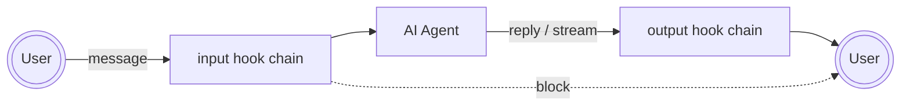
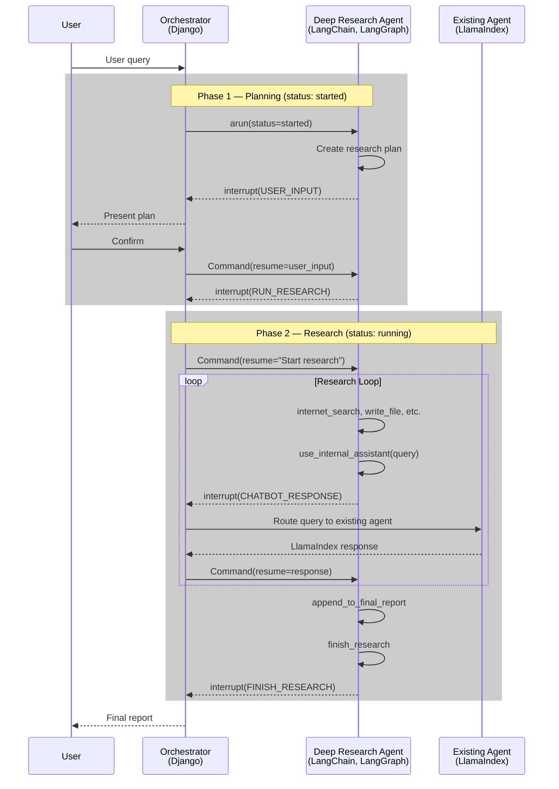
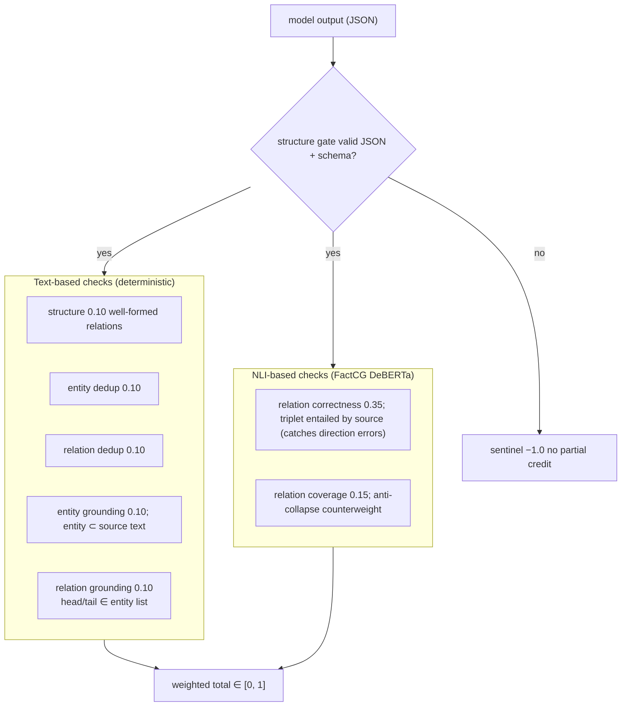
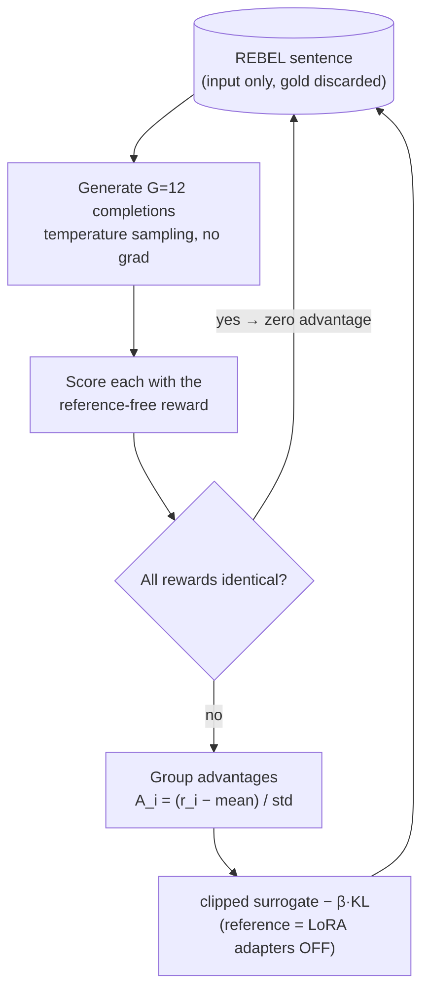

# Wonbin Kim

AI Engineer

Taipei · open to relocation to Singapore

[kwb0711@gmail.com](mailto:kwb0711@gmail.com) · [GitHub](https://github.com/rst0070) · [LinkedIn](https://www.linkedin.com/in/wonbin-kim-7263a7184/) · [HuggingFace](https://huggingface.co/rst0070) · [blog](https://rst0070.github.io/notes)

## Summary

AI Engineer with production experience across the full LLM agent stack — agent orchestration, tool design, sandboxed agent governance (prompt-injection blocking, PII redaction, output moderation), evaluation pipelines, multimodal RAG, and conversation memory.  
  

---  
  

## Skills

- **LLM / Agents:** LlamaIndex, LangChain, LangGraph, RAG (multimodal), agent tools, MCP-style protocols, vLLM, structured outputs, evaluation (DeepEval)
- **Training / ML:** PyTorch, GRPO, QLoRA, LLM fine-tuning, Speaker Verification
- **Infra:** AWS, GCP, Kubernetes, Docker, Terraform, Airflow, Argo Workflows, Elasticsearch, Redis, Kafka, Neo4J
- **Backend / Full-stack:** Python (Django, FastAPI), React / React Native, TypeScript, Java (Spring)
  
  
---
  

## Highlights

- **Agent guardrails at scale** — designed a gVisor-sandboxed, per-tenant middleware layer for AI agents (prompt-injection blocking, PII redaction): **77k executions/week across 10 enterprise orgs**, zero-deployment rule delivery. → [Agent Middleware](#agent-middleware)
- **Memory systems specialist** — fixed silently-failing long-term memory (**0/4 → 4/4 recall across 8,000+ turns**, zero added LLM cost) at MaiAgent → [Agent Conversation Memory](#agent-conversation-memory); previously improved recall **23% → 71%** on a 5M-MAU platform at Wrtn; contributor to **Mem0 (58k★)** → [Mem0 AI Assistant Memory System](#mem0-ai-assistant-memory-system)
- **Multimodal RAG in production** — zero-migration overlay now serving **72% of 9,026 enterprise knowledge bases** with cross-modal search. → [Multimodal RAG](#multimodal-rag)
- **Autonomous agents** — deep-research agent bridging LangGraph and LlamaIndex via a cross-framework interrupt protocol, plus self-serve agent scheduling running **9,600 autonomous runs/week**. → [Deep Research](#deep-research) · [Agent Schedule](#agent-schedule)
- **RL fine-tuning, end to end** — trained a **0.8B model with GRPO** (from-scratch implementation, reference-free NLI reward) to **95% of Gemini 2.5 Flash Lite's score** on knowledge-graph extraction, on a single 16GB consumer GPU. → [Tiny Graph Extractor](#tiny-graph-extractor-—-sub-1b-llm-for-knowledge-graph-extraction)
- **Research** — 1st-author paper on noise-robust speaker verification ([arXiv](https://arxiv.org/abs/2307.10628)).
  

---  
  

## Work Experience

### MaiAgent (AI Engineer, 2025.12 - , Taipei)

AI Agent platform for Enterprise [maiagent.ai](https://maiagent.ai/en/about)

Shipped full-stack AI features end-to-end inside an existing Django + LlamaIndex codebase — designing within the constraints of the existing system, across AI pipeline, backend, and frontend.

#### Agent Middleware
<details>
<summary>Sandboxed per-tenant hook layer around the AI agent — 77k executions/week across 10 enterprise orgs</summary>


```mermaid
flowchart LR
    U(((User))) -->|message| IN["input hook chain"] --> A["AI Agent"]
    A -->|reply / stream| OUT["output hook chain"] --> U2(((User)))
    IN -.->|block| U2
```

**Goal:** Every message rule on the platform — "reply in Traditional Chinese", "never mention competitors", PII masking — relied on prompting, which fails ~5% of the time, or on hardcoded backend logic, which can't scale per-customer in multi-tenant SaaS. The goal was a 100% deterministic interception layer before and after the AI agent, where per-tenant rules ship with no deployment.

**Constraint:** The realistic demand was ~one new custom hook per week — per-customer, written by non-engineers, changing often — which ruled out git-tracked, deploy-gated code and forced untrusted code onto the hot path of every message. The design had to give that code application context without internal access, isolate hooks from different authors sharing one chain, and stream in real time without ever flashing unredacted PII.

**Approach:** Designed and delivered end-to-end a middleware hook system where hook code lives in the database and executes in a gVisor-sandboxed container — one container per trigger point (input / output streaming / output final), with a JSON protocol over a single docker-exec socket as the only integration surface.

- **Three-layer execution model** — application engine, stdlib-only supervisor, per-hook handlers in fresh namespaces. The sandbox is stateless; the trusted side threads a per-hook state vector, so hooks from different authors can't read each other's state.
- **Reverse-direction RPC** (`host_call`) so hooks can invoke application capabilities (run an LLM, consume credit) through a gated capability registry — the sandbox names an effect, the application decides whether it's allowed and what it costs.
- **Dual-path streaming** — a buffered stream path with a lookback tail catches PII patterns split across chunks in real time, while a final pass over the assembled reply is the source of truth for persistence: at worst over-redacted, never under-redacted.
- **Layered isolation** — runtime security via gVisor, code-to-code isolation via fresh namespaces per handler, resource isolation via cgroups, settling on one container per trigger-point chain after ruling out one container per hook as too expensive.
- **Negotiated-union contract for heterogeneous detection vendors** (one supports ~200 PII categories, another 30): business logic owns a small stable category set, providers declare their own catalogs, and selections are validated at configuration time — so provider churn never touches the business contract.

**Result:**

- **77k hook executions per week** against 28k agent messages per week — **~2.7 hook runs per message**, showing adopters chain multiple hooks and attach them to both input and output paths.
- **10 enterprise organizations** (of 107 active on the platform) run custom hooks in production.
- Zero-deployment delivery in practice: new per-customer hooks ship through admin, not through the release cycle.
  

**Write-ups:**  
Design write-ups with the full thought process:
1. [Overall architecture and the sandbox isolation model](https://rst0070.github.io/notes/26-05-29-middleware-of-ai-agent) — trust boundary, three-layer execution, dual-path streaming
2. [Reverse RPC from sandbox to application](https://rst0070.github.io/notes/26-06-08-rpc-from-sandbox-to-application) — capability registry and gate design
3. [A contract for heterogeneous PII/guardrail vendors](https://rst0070.github.io/notes/26-07-22-contract-heterogeneous-adapters) — how the negotiated-union contract was reached

</details>


#### Multimodal RAG
<details>
<summary>Zero-migration multimodal overlay on the existing RAG pipeline — image ingestion, cross-modal retrieval, and image-grounded answers in 6,534 of 9,026 production knowledge bases</summary>

**Goal:** The requirement arrived as a single abstract sentence — "make our RAG support images" — on a platform whose only image handling was chat attachments: no ingestion, no retrieval, no image-aware generation. I scoped it into a concrete end-to-end contract: knowledge bases ingest images (standalone or embedded in documents), and both the RAG chatbot and the agentic chatbot use them at inference — under the same configuration as text, not a separate mode.  
  
**Constraint:**  
- **Text-only LlamaIndex:** The codebase is deeply coupled to LlamaIndex, and LlamaIndex's core abstractions have no concept of image nodes — the response synthesizer flattens every retrieved node to a text string, rerankers assume text content, and the agent framework returns tool results as text only. Images don't fail loudly anywhere; they get **silently stripped** at each layer. Rewriting the stack was off the table, so every fix had to be a surgical extension of an existing LlamaIndex class.
- **The "same index" mandate:** My first design used a separate Elasticsearch index for image vectors, but the direction was "keep it simple" — image data had to live in the **same index** as text nodes, flow through the same ingestion/deletion/persistence pipeline, and require zero migration.
- **Same configuration, graceful degradation:** Multi-tenant reality: some knowledge bases run non-multimodal embedding models, some chatbots run non-multimodal LLMs, and the platform previously reacted to an image by throwing a hard error or silently switching to a different LLM call path. The feature had to be **one code path** that degrades gracefully — images used when the stack supports them, cleanly skipped when it doesn't — with no per-tenant forks.
  
**Approach:** Introduced multimodal processing as an overlay on the existing text pipeline — at every layer it activates only when images are present and the connected components support them; otherwise the original text path runs unchanged.  
- **Indexing with a small trick:** The same-index mandate constrains retrieval too — the *existing* retriever stack had to serve image results, and LlamaIndex has no image support on that path. So an image is indexed as an ordinary text node carrying a `node_type='image'` tag, with its embedding pre-generated by a multimodal model into the shared vector space. Existing indexing, retrieval, and deletion logic runs unmodified; downstream layers recognize images by the tag alone, and one query path yields all four cross-modal modes (text→text, text→image, image→text, image→image).
- **Image ingestion as a capability:** The platform already parsed many document types that can contain images (PDF, Office, …), so image extraction was added as a capability mixed into the existing document readers rather than a new pipeline. Whether it activates is decided not by a hard type check but **at adapter-connection time** — the reader asks the connected knowledge base's embedding model whether it is multimodal, emits image nodes when yes, and emits nothing when no. Text extraction behaves identically either way.
- **Patched LlamaIndex's native engines to carry the custom image structure:** Both inference paths drop images by design — the chat engine's synthesizer flattens every retrieved node to a text string, and the agent framework returns tool results as text only. Extended both: a custom synthesizer that builds LLM messages with real image blocks, and agent-side injection of tool-result images into the scratchpad (budgeted, and cleaned out before memory persistence). Each patch engages only when tagged image nodes actually appear and the LLM is multimodal; otherwise the stock path runs, and images are skipped with a log line — never an error, never a different behavior for the user.
  
**Result:**  
- **72% of active knowledge bases (6,534 of 9,026) now run on the multimodal pipeline** — the overlay design serves the majority of production, not a niche opt-in. The remaining text-only knowledge bases run the same code path with the image logic dormant: the graceful-degradation design carrying both populations in production.
- Enterprise customers can **upload and search images in their knowledge bases for the first time**, in both RAG and agentic chatbots — with cross-modal search (text→image, image→text, image→image) exposed to end users and to the agent as a tool.
- Images went from a failure case — a hard error or a silently different LLM call path — to a **supported modality under unchanged chatbot configuration**, shipped with zero index migration.

<details>
<summary>Details</summary>

- Full pipeline — the three conditional gates are what make it an overlay: text always flows the original path, image logic only engages when every gate passes

    ```mermaid
    flowchart TB
        subgraph ING["Ingestion — existing document pipeline + image capability"]
            direction LR
            UP["Upload<br/>documents (PDF, Office, …)<br/>or standalone images"] --> RD["Existing document parsers<br/>(unchanged)"]
            RD --> TXT["text chunks<br/>indexed as before"]
            RD --> G1{"does this knowledge base's<br/>embedding model support images?<br/>(checked when connected, not hardcoded)"}
            G1 -- yes --> IMG["images stored as tagged entries<br/>with image embeddings"]
            G1 -- no --> NOP["images skipped —<br/>text ingestion unaffected"]
            TXT --> VI[("one shared vector index<br/>text & images in the same<br/>embedding space")]
            IMG --> VI
        end

        subgraph QRY["Inference — RAG mode & AGENT mode"]
            direction TB
            Q["User message<br/>text and/or images"] --> RET["existing retrieval logic<br/>4 cross-modal search modes:<br/>text→text · text→image · image→text · image→image"]
            RET --> G2{"any images involved?<br/>(retrieved or attached)"}
            G2 -- no --> STOCK["original text-only<br/>answer path, unmodified"]
            G2 -- yes --> G3{"does the chatbot's LLM<br/>support images?"}
            G3 -- no --> SKIP["images quietly dropped (logged) —<br/>same answer path, no error"]
            G3 -- yes --> MM["extended answer path:<br/>images sent to the LLM alongside text —<br/>count-limited, never persisted to chat history"]
            STOCK --> LLM[LLM response]
            SKIP --> LLM
            MM --> LLM
        end

        VI --> RET
    ```

</details>
</details>


#### Deep Research
<details>
<summary>OpenAI-style deep research agent built on LangGraph inside a LlamaIndex platform — the two frameworks collaborate through a cross-framework interrupt protocol, with zero changes to the existing pipeline</summary>

**Goal:** An OpenAI-style Deep Research mode inside the existing enterprise
chatbot: the agent plans, gets user confirmation, then autonomously researches
across the web *and* the tenant's internal knowledge bases, files, and tools —
streaming progress live and delivering a structured report — as a per-conversation
mode under unchanged chatbot configuration, not a separate product.  
  

**Constraint:**  
- **New framework by directive, collision by consequence:** The direction was "don't build this on LlamaIndex — research a good deep-research library and integrate it." I evaluated the options and chose deepagents (LangChain/LangGraph). But the entire platform — LLM access, agents, memory, every reply path — is built on LlamaIndex, so any choice meant two frameworks with incompatible LLM interfaces, message formats, and tool-calling protocols running inside one request path.
- **No redesign of the LLM layer:** The codebase-wide rule other engineers rely on is "business logic is coupled to LlamaIndex." Introducing a clean, framework-agnostic inference interface would have broken that shared convention — so the new framework could not get its own LLM stack. LangChain had to drive the existing LlamaIndex LLM abstraction, for every tenant-configured model, including ones with no native function-calling support.
- **Reuse, don't reimplement, the existing chatbot:** Research needed the platform's existing capabilities — knowledge-base retrieval, file/image analysis, per-organization tools — but they are all wired into the "chatbot" pipeline in direct-implementation style, not exposed as callable services. Rebuilding them in the new framework was infeasible; the deep research agent had to invoke the old pipeline as-is.
- **Pause and resume across stateless requests:** Plan confirmation means the agent stops mid-run, waits for a user reply that arrives in a *later* HTTP request — possibly on a different worker — and resumes exactly where it left off, on a pipeline designed for one-shot request/reply.
  
  
**Approach:** Rather than bridging the two frameworks everywhere they disagree, I
confined the collision to two seams — an LLM adapter at the bottom of the stack, a
typed interrupt protocol at the top — and left each framework unchanged on its own
side of the line.  
- **Accept the codebase rule — adapt upward, don't redesign:** LlamaIndex stayed the platform's single LLM abstraction; I wrote an adapter that exposes it as a LangChain `BaseChatModel`, so the new framework drives the old one's LLMs instead of getting a second stack. The adapter absorbs the real gaps: it delegates to native function calling when the tenant's model supports it and falls back to prompt-based JSON tool calling when it doesn't, rebuilds LangChain tool schemas into the typed Pydantic schemas LlamaIndex expects (nested models, enums intact), and swallows provider quirks — so deep research runs on every tenant-configured model, not just the well-behaved ones.

- **A cross-framework interrupt protocol:** I repurposed LangGraph's human-in-the-loop `interrupt()` primitive as a general RPC boundary between the two stacks. Anything the deep research agent cannot do itself is a *typed interrupt* raised from inside a tool; a thin orchestrator loop outside the graph reads the type, fulfills the request — routing it to the human (plan confirmation) or to the existing LlamaIndex pipeline (internal knowledge) — and resumes the graph with the result as the tool's return value. The insight: "waiting for a human" and "waiting for another agent framework" are the same problem — the graph pauses, someone outside answers. Neither framework knows the other exists.

- **The existing chatbot as a sub-agent:** Reimplementing the chatbot's capabilities was off the table, so the entire existing pipeline became the research agent's sub-agent behind a single tool, `use_internal_assistant`. Its description tells the agent the division of labor — what the researcher does (web search, report writing) versus what the sub-agent does (knowledge bases, file/image analysis, org tools). The tool body just raises an interrupt; the orchestrator routes the query through the unmodified chatbot and feeds the answer back. Collaboration by prompt contract, zero changes to the old pipeline.

- **Durable pause/resume with a two-phase state machine:** The agent's serialized checkpoint lives on the conversation record, with a small status machine (planning → researching → completed). Planning runs a strict tool-calling agent whose only moves are "ask the user" or "start research"; confirmation can arrive in a later request on a different worker, and the graph resumes mid-flight. Interrupt budgets degrade gracefully: exhausted interrupt tools stay bound but return redirect instructions instead of pausing — checkpoint replay stays valid while the model gets steered away.

- **Delivered end-to-end:** adapter, interrupt protocol, prompts and agent tools, real-time progress streaming over Socket.IO (progress derived from the agent's own todo list), report rendering as a canvas document, credit-gated web search with idempotent billing, per-turn token accounting including embeddings, and frontend integration.
  

**Result:**  
- **Two heterogeneous agent frameworks collaborate in production with zero changes to the existing pipeline** — the LlamaIndex chatbot serves deep research as a sub-agent through the interrupt protocol, and no interface in the existing codebase was redesigned to make that possible.
- **Deep research runs on every tenant-configured LLM** — including models with no native function-calling support (via the adapter's JSON fallback). No organization had to change its chatbot configuration to gain the feature.
- Delivered as a per-conversation mode of the existing chatbot: plan confirmation survives across requests, progress streams live, and the final report renders as a structured document.

- **Depth per run — a representative example:** one question about Korean invasive-species fishing law triggered **22 autonomous web searches** over Korean-language government, legal, and news sources, producing a **~5,300-word structured report citing 18 distinct sources** — statute-level legal analysis, enforcement assessment, program budget tables, and an international comparison — from a single English-language prompt. Deep research is a deliberate, heavyweight action by design, complementing the chatbot's instant answers.


<details>
<summary>Details</summary>

**Cross-Framework Interrupt Protocol:**  

```mermaid
sequenceDiagram
    participant User
    participant Orch as Orchestrator<br/>(Django)
    participant DR as Deep Research Agent<br/>(LangChain, LangGraph)
    participant EA as Existing Agent<br/>(LlamaIndex)

    User->>Orch: User query

    rect rgba(0, 0, 0, 0.2)
    Note over Orch,DR: Phase 1 — Planning (status: started)
    Orch->>DR: arun(status=started)
    DR->>DR: Create research plan
    DR-->>Orch: interrupt(USER_INPUT)
    Orch-->>User: Present plan
    User->>Orch: Confirm
    Orch->>DR: Command(resume=user_input)
    DR-->>Orch: interrupt(RUN_RESEARCH)
    end

    rect rgba(0, 0, 0, 0.2)
    Note over Orch,EA: Phase 2 — Research (status: running)
    Orch->>DR: Command(resume="Start research")

    loop Research Loop
        DR->>DR: internet_search, write_file, etc.
        DR->>DR: use_internal_assistant(query)
        DR-->>Orch: interrupt(CHATBOT_RESPONSE)
        Orch->>EA: Route query to existing agent
        EA-->>Orch: LlamaIndex response
        Orch->>DR: Command(resume=response)
    end

    DR->>DR: append_to_final_report
    DR->>DR: finish_research
    DR-->>Orch: interrupt(FINISH_RESEARCH)
    end

    Orch-->>User: Final report
```

</details>
</details>


#### Agent Conversation Memory
<details>
<summary>Diagnosed and fixed silently-failing long-term vector memory (0/4 → 4/4 recall across 8,000+ turns) and added agentic conversation-search tools — zero added LLM cost, zero migration</summary>
  
Demo: the agent recovering the exact wording of the first message in a long conversation — an exact-quote recall that pure vector similarity cannot do.  
<video controls preload="metadata" src="/assets/portfolio/conversation-search-tool.mp4"></video>  
  
**Goal:** The assignment arrived deliberately open-ended — "find any issues in our memory system, or points to enhance it" — with a single hint: the agent's recall of prior conversation felt unreliable in production. There was no bug report, no benchmark, no metric; whether memory was even broken was itself the first question to answer. After investigation I scoped it into a two-part goal:
1. **Fix the passive path**
    make long-term vector memory *measurably* reliable: build the missing retrieval evaluation first, then fix whatever it exposes.
2. **Add an active path**
    cover the questions semantic recall structurally cannot answer ("did you resolve the issue I reported last week?", "what exact wording did we agree on?") by letting the agent search its own conversation history through tools.
  

**Constraint:**
- **No way to even see the failure:**
    Long-term memory had no tests, no metrics, and no evaluation data — retrieval could fail silently on every message and nothing would catch it. Any fix had to start by building the measurement that proved the problem existed, and the failures only reproduced at scale (beyond ~50 turns), so realistic multi-thousand-turn conversation data had to be sourced first.
- **Zero additional LLM cost:** 
    Memory runs on every message of every conversation in a multi-tenant SaaS — a per-message LLM call for summarization or reranking (the approach most memory products take) multiplies inference cost platform-wide. Both the fix and the new recall mechanism had to work without adding LLM cost beyond what the pipeline already spent.
- **Existing stack only, no migration:** 
    The memory pipeline is built on LlamaIndex's `Memory` abstraction over a shared Elasticsearch index, and conversations live in the production message table. Improvements had to be surgical extensions of the existing classes — no new index, no schema migration, no replacement framework.
- **The LLM is an untrusted caller:** 
    Any search tool exposed to the agent receives LLM-generated input on a hot path — a malformed or malicious regex hits the production database, and a hallucinated ID could cross conversation boundaries in a multi-tenant system. The tools had to be safe against bad input by construction, not by prompting.
  

**Approach:** One mechanism per goal — repair the passive vector memory so it recalls reliably on its own, and give the agent tools to actively recall what embeddings structurally cannot.  
  
**1. Passive path — measure first, then fix what the measurement exposes:**  
- **Built the missing benchmark before touching the code:**
    a quantitative retrieval evaluation with evidence-based ground truth, built from the Salesforce/ConvoMem HuggingFace dataset and published as a reusable dataset ([wonbin-tw/mem-test](https://huggingface.co/datasets/wonbin-tw/mem-test)) — 4 recall scenarios over multi-thousand-turn conversations, run against the real production stack (Elasticsearch + OpenAI embeddings), so a "fix" only counts if the number moves.
- **Two root causes surfaced by systematic testing:**
    LlamaIndex's default XML-wrapped formatting of stored memory nodes was degrading vector similarity matching, and the absence of deduplication was polluting the Elasticsearch index with identical memory chunks.
- **Rewrote the persistence path, not the retrieval path:** 
    each message is now stored as a structured Document carrying session ID, role, and message metadata instead of preformatted XML — role markup is re-attached at *read* time for the LLM, so presentation never contaminates the embedding space. Deduplication became a property of the write path itself: every node gets a deterministic content-hashed ID, so re-ingesting identical content overwrites instead of duplicating — no cleanup job, no second index.
  
**2. Active path — a search → locate → expand pattern over the conversation:**
- **Two tools, deliberately asymmetric:** 
    a *search* tool does keyword/regex search over the current conversation and returns many short snippets with match positions; an *expand* tool returns the N neighboring messages around one chosen match. Splitting "many shallow matches" from "one deep context window" lets the LLM chain them efficiently — wide and cheap first, deep and targeted second — instead of overpaying tokens on every call.
- **Safe against the untrusted caller by construction:**
    pattern length cap, per-message content truncation, page size and context window caps, and a silent fallback to literal substring search when an LLM-supplied regex fails to compile — invalid input never surfaces as an exception to the agent. The conversation ID is bound when the tool is constructed, never a tool parameter, so the LLM cannot query another tenant's conversation; a foreign message ID simply reads as "not found."
- **The tools don't pollute the memory they compensate for:** 
    tool outputs are tagged so the memory layer keeps raw search dumps out of long-term vector and fact memory — recall stays a read path, never a feedback loop.
  
  
**Result:**
- **Recall went from broken to reliable at production scale:**
    memory retrieval was completely failing beyond ~50 conversation turns (0/4 benchmark cases); after the persistence-path rewrite it reliably retrieves across **8,000+ turns (4/4 cases)** — sufficient for typical annual usage of a single conversation.
- **Zero added LLM cost, as constrained:**
    the recall fix is pure storage-format and deduplication work, and the new tools are database queries — no summarization calls, no reranking calls, no per-message inference added to the platform, unlike memory solutions that rely on LLM-powered summarization.
- **A class of previously unanswerable questions became answerable:**
    time-referenced and exact-quote recall ("did you resolve the issue I reported last week?", "what exact wording did we agree on?") now works through the search → expand tool chain — shipped with no new index and no migration.
- **The failure mode itself is now visible:** 
    the retrieval benchmark is a permanent, reusable asset ([wonbin-tw/mem-test](https://huggingface.co/datasets/wonbin-tw/mem-test)) — any future memory regression shows up as a number, not as a customer complaint.
</details>


#### Agent Schedule
<details>
<summary>Autonomous agent scheduling (cron / interval / one-shot) built by injecting synthetic user messages into the unchanged reply pipeline — 9,600 runs/week from 143 self-serve production schedules</summary>
  

**Goal:** The requirement arrived as a one-line verbal request inspired by a competitor feature — "our agents should be able to run on a schedule." I scoped it into a concrete end-to-end contract: any AI agent on the platform can execute autonomously — on a cron expression, a fixed interval, or a one-time trigger — with its result delivered to the places people already watch (existing conversations, external systems via webhook), every run recorded in an auditable history, and the whole thing configured self-serve by enterprise admins under per-tenant limits, not provisioned by engineers.  
  
  
**Constraint:**  
- **No spec, no scheduling infrastructure:** nothing in the platform executed anything on a timer, and there was no product design to work from — what "running on a schedule" should mean, both as a product and as an architecture, was mine to define against a one-sentence request.
- **The agent is not a callable service:** the codebase is written in direct-implementation style — agent invocation, message persistence, and token billing are wired inline into one flow that assumes a real human sending a message into a conversation. There is no portable "run the agent" interface to call from a scheduler, and rebuilding one would fork billing and persistence logic that must stay consistent. Scheduled execution had to enter through the existing human-facing pipeline unchanged.  
  

**Approach:** Two design decisions shaped the system: don't extract the agent — impersonate the user instead; and treat every run as unattended by default, so failure handling is designed in, not bolted on.  
- **The scheduler enters the pipeline as a synthetic user:** instead of carving a callable interface out of the direct-implementation pipeline, each schedule owns a system-created contact, and every run injects the schedule's prompt as a synthetic incoming message — then lets the unchanged reply pipeline do what it always does: invoke the agent with the tenant's full configuration (knowledge bases, tools, LLM), persist messages, bill tokens. The agent cannot tell a scheduled run from a human one, and zero inference logic was forked or duplicated.
- **Two execution modes, because "run on a schedule" splits into two products:**
  *in-context* mode gives a schedule a dedicated persistent conversation, so
  each run sees the accumulated history of previous runs — enabling iterative
  work like "compare today's numbers with the trend you reported yesterday."
  *Isolated* mode creates an ephemeral conversation per run and destroys it
  after — stateless by construction for repeated one-shot tasks. One prompt
  field, one pipeline, two memory semantics.
- **Trigger layer on Celery Beat:** each schedule maps to a dynamically managed periodic task — cron (timezone-aware), fixed interval, or one-shot — with a lifecycle service keeping the scheduler entry in sync through create, update, pause, and soft-delete.
- **Reliability designed for nobody-is-watching:** the task queue's at-least-once semantics mean a killed worker redelivers the task — and a duplicate run silently spends real tenant credits — so every execution is deduplicated by an atomic per-schedule lock. A guard chain (enabled → max executions → credit balance) runs before the agent does, every run writes an audit record with status, errors, and per-run token usage, and delivery to multiple targets degrades to a "partial" status per failed target instead of all-or-nothing.
- **Tenant input is validated by construction, not trust:** an arbitrary cron expression's real firing frequency can't be checked statically, so it is measured — simulating upcoming fire times and rejecting expressions that beat the platform's minimum interval. Webhook delivery goes through an SSRF-safe transport, delivery targets are validated to stay inside the tenant's own agent, and per-organization caps bound how many schedules can be active.
  

**Result:**  
- **9,600 autonomous agent runs per week** from **143 production schedules** — on a platform serving 107 active organizations, scheduled execution went from nonexistent to a continuously running workload.
- **Zero-engineer provisioning in practice:** every schedule was configured self-serve by customers through the API and admin UI — none required a deployment or engineering involvement, the contract the design promised.
- **Every run is accountable:** each of those 9,600 weekly executions writes an audit record with status, errors, and token usage — unattended failures surface as queryable records, not silent gaps or customer complaints.
- Delivered end-to-end: data models, service layer, REST API (CRUD, pause/resume, run-now), Celery task and Beat integration, and admin frontend.

<details>
<summary>Details</summary>

- Execution modes — **in-context** (persistent conversation with accumulated context across runs) and **isolated** (stateless, ephemeral resources cleaned up after each run), supporting both iterative analysis and one-off tasks
- Architecture

    ```mermaid
    flowchart TD
        subgraph Trigger["Schedule Trigger"]
            CB[Celery Beat] -->|cron / interval / one-shot| Task[Celery Task]
        end

        Task --> Guards

        subgraph Guards["Pre-execution Guards"]
            direction LR
            CK[Credit Check] --- EN[Enabled Check] --- MX[Max Executions Check]
        end

        Guards --> Mode{Execution Mode}

        subgraph Execution["Agent Execution"]
            Mode -->|In-Context| IC[Chatbot Ability\n+ Accumulated Context\nvia dedicated conversation]
            Mode -->|Isolated| IS[Chatbot Ability Only\nephemeral conversation\ncleaned up after run]
        end

        IC --> Delivery
        IS --> Delivery

        subgraph Delivery["Multi-Target Delivery"]
            direction LR
            CV[Conversations\noutgoing messages] --- WH[Webhooks\nHTTP POST]
        end

        Delivery --> Audit[Execution Audit Record\nstatus / token usage / errors]
    ```

</details>
</details>
  
  
#### Agent Evaluation
<details>
<summary>Tiered pass/fail semantics over DeepEval metrics and an LLM-generated improvement playbook — evaluation results non-technical enterprise users can actually act on</summary>

- **Constraint:** The existing evaluation pipeline used DeepEval’s raw metric pass/fail output directly — non-technical enterprise users received 8+ individual metric scores with no guidance on which failures mattered or what to do about them, making evaluation results effectively unactionable.
- Redesigned the pass/fail determination as a **tiered metric priority system**, derived from studying DeepEval’s metric semantics, to prevent noisy metrics like Context Relevancy and Tool Correctness from failing test cases that achieved the correct outcome

    <details>
    <summary>Details</summary>
    
    Safety metrics (Bias, Toxicity, Hallucination) take highest priority, followed by Outcome metrics (Answer Relevancy, Task Completion), then Grounding metrics (Context Recall)
    
    Algorithm:
    
    ```mermaid
    flowchart TD
        Fail[success = False]
        Start([Each test case]) --> Classify[Classify metrics into 4 tiers:<br/>• Guardrails<br/>• Outcomes<br/>• Groundings<br/>• Others]
        Classify --> T1{Tier 1: All<br/>Guardrails passed?}

        T1 -->|No| Fail
        T1 -->|Yes| T2{Tier 2: All<br/>Outcomes passed?}

        T2 -->|No| Fail
        T2 -->|Yes| T3{Tier 3: All<br/>Groundings passed?}

        T3 -->|No| Fail
        T3 -->|Yes| T4{Tier 4: All<br/>Others passed?}

        T4 -->|Yes| Pass([PASS<br/>success = True])
        T4 -->|No| Override{Adaptive Override:<br/>Do all 3 core tiers<br/>have at least 1 metric?}

        Override -->|Yes<br/>Ignore Others| Pass
        Override -->|No| Fail
    
    ```

    </details>

- Built an LLM-powered insight generation layer using Structured Outputs that automatically produces a natural-language summary, per-metric severity classification, and prioritized actionable recommendations with rationale — transforming raw evaluation data into an improvement playbook for non-technical users, with on-demand multilingual translation via Celery async tasks

    <details>
    <summary>Details</summary>

    

    </details>

- Hardened the evaluation pipeline for production reliability: implemented resumable batched execution with per-test-case retry tracking, structured output fallbacks for lower-capability LLMs, and real-time progress tracking via Socket.IO event broadcasting
- Decoupled the evaluation pipeline from OpenAI behind a provider-agnostic interface, enabling enterprise customers to use self-hosted LLMs via vLLM
</details>
  
  
#### Production Hardening
<details>
<summary>Auth/session security overhaul and resumable LLM streaming — full-stack reliability work across Django, Redis, Socket.IO, and two Vue apps</summary>

Shipped end-to-end (backend + frontend) alongside the AI feature work:

- **Auth & session security:** Logout didn't actually end sessions — access tokens had a **100-year lifetime** with no revocation, live Socket.IO connections survived logout, and SSO logout left refresh tokens valid for 30 days. Redesigned the session lifecycle so logout means logout: short-lived tokens (**100 years → 15 minutes**) backed by Redis-based revocation and instant per-user socket disconnect, with silent token refresh built across two Vue apps so the tighter security cost users nothing.
- **Resumable LLM streaming:** Streamed responses were lost on any mid-generation disconnect (page refresh, network switch), forcing full regeneration. Added a Redis-backed catch-up cache that replays the stream to reconnecting clients — **recovery without re-triggering the LLM call**.
</details>

### Wrtn Technologies (Data Engineer Intern, 2024.12 - 2025.06, Seoul)

AI-search platform serving 5 million monthly active users [wrtn.ai](https://wrtn.ai/)  

I had the opportunity to experience data infrastructure and AI systems in a fast-paced startup environment through daily scrums and cross-functional collaboration.

#### Long Term Memory Module
<details>
<summary>Evaluation-driven overhaul of the AI assistant's long-term memory — built the recall benchmark from real user conversations, settled a buy-vs-build decision with it, and improved memory recall accuracy from 23% to 71%; the feature became the core of the Wrtn 3.0 release.</summary>
  
**Goal:** Wrtn's AI assistant needed long-term memory: remember what a user said across conversations and bring it back at the right moment. The work arrived as a buy-vs-build decision — adopt mem0's managed service, or run mem0's open-source logic in-house — and I was asked to compare the two. That comparison immediately exposed the real problem: **there was no way to measure memory quality at all**, so before any decision could be made, evaluation itself had to be built.  
  

**Constraint:**  
- **No usable benchmark.** I surveyed the memory-evaluation literature and analyzed LongMemEval in depth, but its dataset didn't fit a Korean-language production assistant. The only thing that transferred was the core idea: measure **recall** — given a question, did the system retrieve the right memory?
- **The evaluation had to come from real data.** Wrtn's strongest asset was real user conversation logs, but turning them into a test set required cross-functional work with data-labeling specialists — question authoring and review couldn't be automated away.
- **Korean-language reality.** The memory extraction prompts and embedding defaults were tuned for English; memory items came out in inconsistent shapes, and retrieval quality suffered accordingly.
- **A live production system.** Improvements had to be verified against the metric before shipping, and memories already written in wrong formats were sitting in production — fixing the pipeline forward wasn't enough; the stored data had to be repaired too.
  
  
**Approach:**  
**1. Built the evaluation pipeline first** (with data-labeling specialists):
- Sample a statistically diverse set of users from production data
- Ingest each user's full utterance history into the memory system
- Test with questions authored and reviewed by question inspectors
- Score recall: for each question, whether the system retrieved a correct memory

**2. Ran the POC — and the baseline killed the "buy" option.** The in-house system retrieved at least one correct memory for only **23 of 100** questions (0.23). mem0's managed service did worse: **0.10**. The managed-service option was dropped with evidence, and the work pivoted to improving the in-house system.

**3. First improvement round — memory format and embeddings (0.23 → 0.51).** Documented the root causes: no Korean-grounded examples in the extraction prompts, no enforced memory shape, and an unoptimized embedding setup. Fixes:
- **Standardized 4-part memory format** — key sentence / keywords / time metadata in natural language / expanded memory that spells out inferable context — enforced through Korean-based few-shot examples
- **Task-specific embeddings via Vertex AI** — separate query-side and storage-side embeddings instead of one shared embedding

**4. Second improvement round — three controlled retrieval experiments on Elasticsearch (0.51 → 0.71):**
- **Embedding size comparison** — recall vs. embedding dimension at document-indexing time
- **Hybrid search weighting** — tuning the balance between term search and vector search in Elasticsearch hybrid queries
- **Search context length** — how many of the user's recent messages to use as the retrieval query

**5. Repaired production data.** Memory items already stored in wrong formats — including duplicates traced to an async/await bug in mem0's open-source logic — were fixed by backfill batches built on **AWS Batch and Argo Workflows, monitored with Datadog**. The duplication root cause was fixed upstream as well: my [mem0 contribution](https://github.com/mem0ai/mem0/issues/2578) resolving the memory duplication issue (see *Open source contribution — Mem0*).

**6. Documented the next steps** as the internship closed: a graph-memory design doc (what a graph DB buys for memory storage and how to structure it) and an evaluation-set improvement guide (clearer questions, more diverse scenarios).
  

**Result:**  
- **Memory recall accuracy 0.23 → 0.71 (~3×)** on the real-user evaluation set, through two documented, metric-verified improvement rounds
- **Buy-vs-build settled with evidence** — the managed service scored 0.10 vs. the in-house 0.23 baseline, ending the POC decisively
- **Production data repaired, root cause fixed upstream** — backfill batches corrected wrong-format and duplicated memories, and the duplication fix landed in mem0 itself (58k-star open-source project)
- The memory feature shipped as **the core of the Wrtn 3.0 release** — covered by AI Times: "Memory is the core of wrtn 3.0"
  

<details>
<summary>Details</summary>
News Article: "Memory is the core of wrtn 3.0 release"


[https://www.aitimes.com/news/articleView.html?idxno=169537](https://www.aitimes.com/news/articleView.html?idxno=169537)

**Standardized memory format** (translated example):

```
{key sentence}
{keywords}
{time metadata, natural language}
{expanded memory}
```

```
The user has been a member of UAENA, IU's fan cafe, since 2024.
IU, UAENA, fan cafe, member, since 2024
since 2024
The user has been a member of UAENA, IU's fan cafe, since 2024. IU is a Korean female K-Pop solo artist, which signals the user's musical taste. IU is also an active actress, so reflecting this in media recommendations would help the conversation.
```

**Before / after on a real failure case** (translated, sanitized): a crypto-trading user had repeatedly told the assistant they do **not** buy Bitcoin — they trade Ethereum, Dogecoin, and Ripple — yet every regenerated trading script came back hardcoded to Bitcoin, and the user's frustration escalated across the session. With the improved memory in place, the new response stopped assuming Bitcoin and preserved the user's stated trading rules — the kind of repeated-preference failure long-term memory exists to prevent.

</details>
</details>
  

#### RAG System
<details>
<summary>Built the RAG pipeline that lets Wrtn's AI assistant answer questions about Wrtn itself — settled the index structure through controlled experiments, added LLM enrichment on both the document and query side, and reached 75% accuracy on implicit questions; shipped with the Wrtn 3.0 release.</summary>

**Goal:** For the Wrtn 3.0 launch, the AI assistant had to answer questions about Wrtn itself — its features, plans, policies — from the internal user guide, a single Notion document that was the source of truth about the service. The baseline failed at the most basic level: asked *"tell me about yourself"*, the assistant didn't recognize that Wrtn was the subject — **even with search forced on**, nothing relevant came back. Two OKRs framed the work:
- **The documented data must be searchable** — with a structure that converts 100% reliably every time the document changes
- **≥70% search performance on implicit queries** — questions that never explicitly say "Wrtn"
  

**Constraint:**
- **No given structure.** Wrtn 1's user guide had been clean question–answer pairs; the new guide was a free-form Notion document — headings, nested lists, deep hierarchy. Retrieval structure had to be *derived* from it, and the derivation had to survive every future revision of the doc.
- **Implicit queries were the real workload.** Actual users ask *"tell me about yourself"*, *"can I set your name?"* — utterances with no lexical or semantic anchor to a company document. Plain similarity search over raw chunks misses them.
- **No automated quality metric.** Answer quality was end-to-end and qualitative, so evaluation had to be built: an 88-question set of real-style Korean user questions, each candidate answer judged side-by-side against a reference good answer (+1 good / 0 neutral / −1 wrong or irrelevant), scored across the full retrieval → search planner → LLM chain — with token cost and search latency tracked alongside quality for every candidate.
- **The document churned.** Startup reality: the user guide changed frequently, and updates couldn't stay a manual developer task.
  

**Approach:** Fix the index structure with controlled experiments first, then enrich both sides of the search, then productize the pipeline.

**1. Three controlled experiments settled the Elasticsearch structure** (each judged on the 88-question set, with cost and latency tracked):
- **Chunking: sliding window vs. semantic segmentation.** Sliding window (2,500 chars, 500 overlap) against parsing the Notion document's headings and list structure into a tree and indexing each node as *category + content*. Score: **−9 vs. +12** — a 21-point swing on the 88-question set — at equal token cost and slightly *better* latency. Semantic segmentation won decisively (scoring was stopped at 19 questions because the gap was already conclusive).
- **Tree depth.** How deep into the category tree to segment: depths 2–5 scored **13 / 11 / 9 / 8** — depth 2 won, at no meaningful cost difference.
- **Hybrid search weighting.** Embedding-search weight between the category and content fields: 0.2/0.8, 0.5/0.5, 0.8/0.2 scored **12 / 6 / 1** — content-heavy won.

**2. Document-side enrichment — key expansion.** For every indexed node, an LLM (GPT-4o-mini) generates a **summary, keywords, and expected questions**, indexed alongside the category and content. This is what gives implicit questions something to hit: *"tell me about yourself"* matches an expected question even though it never mentions Wrtn.

**3. Query-side enrichment — search planner.** Reworked how the planner extracts search queries from the user's utterance: query expansion that emits **category keywords** from the guide's tree (e.g. *"tell me about wrtn"* → a fan-out of category-grounded query texts like "wrtn user guide", "service introduction", "wrtn features"), plus intent-classification prompt engineering so the planner routes Wrtn-related utterances to the guide index at all.

**4. Productized the update pipeline.** The initial pipeline was Notion doc → tree parsing → chunking → enrichment → embedding → Elasticsearch upload. I then replaced the brittle Notion-parsing stage with a **FastAPI REST endpoint accepting tree-structured documents directly**, wired into **Retool** so non-engineers ship guide updates end-to-end — async batch indexing under the hood, multilingual index mapping (Korean nori / English / Japanese kuromoji analyzers), and a schema unified with the platform's newer collections so future search features could span both.
  

**Result:**
- **75% accuracy on implicit question answering** — measured by the internal data-labeling team against the 70% OKR target
- **Index structure decided with evidence, not convention** — semantic segmentation beat sliding-window chunking by 21 points (−9 → +12) on the 88-question human-judged set, at equal cost and latency; depth and hybrid weights settled the same way
- **The assistant now knows what it is** — *"tell me about yourself"* retrieves the user guide and answers with Wrtn's actual features (before/after below); *"how can a marketer use wrtn"* went from generic AI-assistant advice to Wrtn-specific tool recommendations
- **Document updates became self-serve** — the Retool + REST pipeline removed engineers from the update loop entirely
- Shipped as part of the **Wrtn 3.0 release**
  

<details>
<summary>Details</summary>

**Evaluation method:** 88 real-style Korean user questions. For each experiment, every candidate configuration answered all questions end-to-end (Elasticsearch → search planner → LLM); answers were placed side-by-side against a reference good answer and human-judged +1 / 0 / −1, only marking meaningful differences. Token usage and search latency were recorded per candidate so quality wins couldn't hide cost regressions.

**Experiment 1 — chunking structure:**

|  | Sliding window | Semantic segmentation |
| --- | --- | --- |
| Quality score | −9 | **+12** |
| Token usage (avg) | 142 | 130 |
| Search latency (avg, s) | 2.64 | 2.28 |

**Experiment 2 — tree depth:**

|  | depth-2 | depth-3 | depth-4 | depth-5 |
| --- | --- | --- | --- | --- |
| Quality score | **13** | 11 | 9 | 8 |

**Experiment 3 — hybrid search weights (category / content):**

|  | 0.2 / 0.8 | 0.5 / 0.5 | 0.8 / 0.2 |
| --- | --- | --- | --- |
| Quality score | **12** | 6 | 1 |

**Enriched document format** (indexed per tree node):

```markdown
## Summary
{summary}

## Keywords
{keywords}

## Expected Questions
{expected_questions}

## Category
{user_guide.category}

## Content
{user_guide.content}
```

**Query expansion example** (translated):
- User utterance: *"tell me about wrtn"*
- Planner query texts: *"wrtn user guide, wrtn, service introduction wrtn features, wrtn service URL, about wrtn, features and services"*

**Before vs. after** (translated, question: *"tell me about yourself"*) — before, the assistant failed to recognize Wrtn as the subject even with forced search; after, the user guide is retrieved and grounds the answer:


**Before vs. after** (translated, question: *"how can a marketer use wrtn well?"*) — before, generic advice about using an AI assistant; after, Wrtn's own tool features:


**Retool interface for document updates** (translated):


</details>
</details>


#### Data pipelines
<details>
<summary>Details</summary>
- Developed data pipelines used in the RAG system, leveraging Airflow, BigQuery, AWS Batch, and Elasticsearch
- Developed a deal-price crawling pipeline extracting structured data from 20+ e-commerce sites, leveraging a vision language model (GPT-4o mini)
</details>
  

#### AI Quality Assurance & Automation
<details>
<summary>Details</summary>
- Developed automated quality evaluation system using LLM-powered validation to reduce manual data labeling workload and improve development velocity
- Deployed production-ready evaluation API with FastAPI and Retool integration for real-time quality assessment workflows

**Example:**  
Retool interface of evaluation result (translated)


</details>
  
  
---

## Open source contribution

### Mem0 AI Assistant Memory System

<details>
<summary>mem0 is an open source AI assistant memory system that has received over 58k stars on GitHub. I contributed to the project by improving customization for actions and queries, and fixing critical data duplication issues.</summary>    
  
- GitHub: [mem0ai/mem0](https://github.com/mem0ai/mem0)
- All contributions: [Pull Requests](https://github.com/mem0ai/mem0/pulls?q=is%3Apr+author%3Arst0070)
    - Contributed to redesigning embedding modules to support task-specific actions
    - Contributed to enabling customization on memory action prompt and related documents
    - Contributed to enabling customization on Elasticsearch query
    - Contributed to fixing [memory duplication issue](https://github.com/mem0ai/mem0/issues/2578) by implementing proper async/await pattern

**Screenshot of PRs**


</details>

### Terraform Libvirt Provider
<details>
<summary>A Terraform provider to provision infrastructure with Linux's KVM using libvirt. I contributed to the project by fixing mismatched support for libvirt volume import.</summary>  
  
- GitHub: [dmacvicar/terraform-provider-libvirt](https://github.com/dmacvicar/terraform-provider-libvirt)
- Contributions: [Pull Requests](https://github.com/dmacvicar/terraform-provider-libvirt/pulls?q=is%3Apr+is%3Aclosed+author%3Arst0070)
</details>
  
  
---

## Personal Projects

### Tiny Graph Extractor — Sub-1B LLM for Knowledge Graph Extraction
<details>
<summary>Fine-tuned Qwen3.5-0.8B with GRPO to extract entities and (head, relation, tail) triplets from text — replacing the frontier-LLM API calls in the knowledge graph management system built for the Moodmate project with a model that trains and runs on a single consumer GPU (RTX 4060 Ti, 16GB).</summary>  
  

GitHub: [rst0070/tiny-graph-extractor](https://github.com/rst0070/tiny-graph-extractor)
QLoRA adapter(huggingface): [rst0070/tiny-graph-extractor-qwen3.5-0.8b-qlora](https://huggingface.co/rst0070/tiny-graph-extractor-qwen3.5-0.8b-qlora)  


- **Purpose:** The [knowledge-graph pipeline](https://github.com/rst0070/knowledge-base) made multiple frontier-LLM structured-output calls per ingested document (entity extraction, edge extraction, knowledge checking) — per-call cost scaling linearly with document volume. Extraction is a narrow, structured task; the goal was to replace it with a sub-1B fine-tuned model, trading recurring API cost for a one-time training cost, and closing the quality gap to a hosted API baseline (Gemini 2.5 Flash Lite).

- **Constraint — no definition of what a "good" knowledge graph is:** Open extraction has no single correct answer, which broke every reference-based approach I tried first:
    * A token-matching supervised loss (initial SFT attempt) mostly measured *output structure*, not content quality — the model earned low loss by reproducing formatting, giving no signal about whether the extracted knowledge was right.
    * Even with gold labels, you cannot say *which phrasing* of a relation is "the answer": canonicalized gold (`Steve Jobs —founded→ Apple`) scored a correct surface-form extraction (`Apple —was founded by→ Steve Jobs`) as wrong. Measured on identical predictions: relation F1 0.21 vs entity F1 0.71 — the metric was punishing wording, not errors.
    * **Conclusion:** stop scoring against a reference answer; score the output against the *source text itself*, reference-free. This one decision shaped both the evaluation and the training method.

- **Evaluation design — a reference-free reward, validated before trusted:** Decomposed "good extraction" into 7 independently checkable properties, using deterministic text checks wherever text suffices and an NLI judge only for what strings cannot catch:
    * **Text-based checks (cheap, deterministic):** structure gate (valid JSON/schema or sentinel −1.0), entity/relation deduplication, **entity grounding** (each entity must appear as a normalized substring of the source), and **relation grounding** (each triplet's head/tail must appear in the emitted entity list — transitively tying every triplet to the source through the grounded entities).
    * **NLI-based check (for what strings can't judge):** relation *correctness* — whether "A relation B" is actually asserted by the text, including direction errors like swapped subject/object — scored by verbalizing each triplet and asking an entailment model (FactCG DeBERTa-v3-Large) with the source as premise. A **coverage** component (accepted unique triplets vs expected count) acts as the anti-collapse counterweight, since a precision-only reward is maximized by emitting almost nothing.
    * **Validated the judge with negative controls** before letting it train anything: scored all 731 gold relations plus corrupted-triplet controls. The NLI model separates true from false almost perfectly (AUC 0.998; every clearly-false triplet < 0.28) — but a naive 0.5 accept threshold sat *inside* the gold score mass, rejecting 35% of correct answers. Replaced the hard threshold with a linear acceptance ramp placed in the empirically measured true/false gap, and computed the reward's ceiling from gold's own score (~0.93) so results are read as distance-to-ceiling, not to 1.0.

- **Test set construction:** The first eval set (fully LLM-generated) was unrealistically clean and used a different relation vocabulary than the model's outputs — comparing against it penalized on-contract behavior. Rebuilt a frozen 200-item set with a realistic distribution: CrossRE samples across 6 domains (AI, literature, music, news, politics, science) + manually collected real news snippets and headlines translated from ~10 source languages, keeping translation artifacts and truncation as deliberate distribution properties. Gold graphs were authored under a written **surface-form style guide** (lift predicates verbatim, keep the sentence's direction, split conjunctions into per-entity triplets, no world-knowledge inference), with per-item provenance metadata so results can be sliced by origin.

- **Training design — GRPO directly on the base model, no SFT:**
    * REBEL is used only as a *source of input sentences* — its gold answers are discarded. Each step samples a group of 12 completions for one prompt, scores them with the same reference-free reward, and pushes the policy toward above-average completions: group-normalized advantages, clipped surrogate objective, per-token KL to a reference policy (DeepSeek formulation) — with the reference implemented as the same model with LoRA adapters disabled, so no second model in memory. Loss math covered by unit tests.
    * Fit rollout + NLI judge + QLoRA policy (4-bit base + LoRA adapters) on one 16GB GPU with a predictive/reactive VRAM strategy: token-budget batching with length-bucketed shuffling, plus OOM-catch with recursive batch halving and token-weighted loss accumulation for mathematically identical gradients.
    * Ran 5 GRPO iterations with **one attributable change per run**, each driven by a written diagnosis of the previous run's reward behavior — e.g., run 5 raised only the acceptance ramp's low edge after quantifying that garbage-level relations were still earning floor credit, which reversed an over-extraction trend (predicted/gold relation ratio 1.62 → 1.50) while correctness kept rising.
    * Reported gains against a paired 95% CI over the 200 items, only claiming run-to-run improvements that clear the noise band.

- **Results (200-item test set, reference-free reward, sentinels included):**
    * Mean total reward **0.422 → 0.796** (pretrained → GRPO 5) vs Gemini 2.5 Flash Lite at 0.858, against a measured ceiling of ~0.93 — the 0.8B model closes most of the gap to the hosted API.
    * Structured-output reliability: parse failures **41/200 → 8/200, matching Gemini exactly**.
    * All three separating components improved: relation correctness 0.631 → 0.740, relation grounding 0.671 → 0.896, coverage 0.729 → 0.840 (Gemini: 0.869 / 0.913 / 0.939).
- Tools used: PyTorch, GRPO (from-scratch implementation), QLoRA (PEFT + bitsandbytes), Unsloth, HuggingFace Transformers & Datasets, FactCG DeBERTa-v3 NLI, CrossRE, REBEL (inputs only), Qwen3.5-0.8B, W&B, Docker, pytest


<details>
<summary>Details — results, GRPO loop</summary>

**Benchmark vs Gemini 2.5 Flash Lite** — fixed 200-item test set, scored by the reference-free reward. "Mean total" counts unparseable outputs as −1.0 (the quantity GRPO optimizes); "weighted total" is over parsed outputs only:

| | Gemini 2.5 Flash Lite | Qwen3.5-0.8B pretrained | GRPO run 5 |
|---|---|---|---|
| mean total (incl. parse failures) | 0.858 | 0.422 | **0.796** |
| weighted total (parsed only) | 0.935 | 0.788 | **0.871** |
| parse failures / 200 | 8 | 41 | **8** |

Progression across runs (mean total): 0.422 (pretrained) → 0.581 → 0.663 → 0.775 → 0.792 → **0.796**. The gains come both from eliminating parse failures (41 → 8, matching Gemini) and from steady relation-quality improvement.

**Reference-free reward composition (eval weights):** 


```mermaid
flowchart TD
    OUT["model output (JSON)"] --> GATE{"structure gate valid JSON + schema?"}
    GATE -- no --> SENT["sentinel −1.0 no partial credit"]
    GATE -- yes --> TXT
    subgraph TXT["Text-based checks (deterministic)"]
        direction LR
        ST["structure 0.10 well-formed relations"]
        ED["entity dedup 0.10"]
        RD["relation dedup 0.10"]
        EG["entity grounding 0.10; entity ⊂ source text"]
        RG["relation grounding 0.10<br/>head/tail ∈ entity list"]
    end
    GATE -- yes --> NLI
    subgraph NLI["NLI-based checks (FactCG DeBERTa)"]
        direction LR
        RC["relation correctness 0.35; triplet entailed by source (catches direction errors)"]
        RV["relation coverage 0.15; anti-collapse counterweight"]
    end
    TXT --> SUM["weighted total ∈ [0, 1]"]
    NLI --> SUM
```

- The GRPO loop (one prompt = one optimizer step):


```mermaid
flowchart TD
    DS[("REBEL sentence<br/>(input only, gold discarded)")] --> GEN["Generate G=12 completions<br/>temperature sampling, no grad"]
    GEN --> SCORE["Score each with the<br/>reference-free reward"]
    SCORE --> CHECK{"All rewards identical?"}
    CHECK -- "yes → zero advantage" --> DS
    CHECK -- no --> ADV["Group advantages<br/>A_i = (r_i − mean) / std"]
    ADV --> LOSS["clipped surrogate − β·KL<br/>(reference = LoRA adapters OFF)"]
    LOSS --> DS
```

**Negative-control validation of the NLI judge (why the ramp exists):** 
gold relations vs corrupted triplets scored by the same judge — AUC 0.998, all clearly-false mass < 0.28, but 35% of gold below the naive 0.5 threshold. The acceptance ramp [0.20, 0.50] sits in the measured gap, giving borderline triplets a gradient instead of a per-rollout coin flip.

</details>
</details>
  

### **OffNote AI — On-Device Note AI (iOS)**
<details>
<summary>A privacy-first note-taking app that extracts facts from user memos and uses them to answer questions in chat — running fully on-device with no cloud calls, no analytics, and no account required.</summary>  
  
[apps.apple.com/us/app/offnote-ai/id6762131607](https://apps.apple.com/us/app/offnote-ai/id6762131607)


- **Constraint**: Targeted a 0.8B quantized LLM (Qwen 3.5, Q4) and a 137M embedding model (Nomic Embed v1.5, Q8) running through llama.cpp on phones with limited RAM and a small context window — too small for a normal LLM workflow
- Designed an on-device fact extraction pipeline after empirically ruling out knowledge-graph extraction across 5 self-built test scripts: grammar-constrained JSON collapsed the small model's output, nested entity/relation schemas exceeded its capacity, and an LLM-as-judge verifier proved no smarter than the extractor itself.
- Settled on a sliding-window approach (3 sentences with 1-sentence overlap) with two-shot prompting and a deterministic token-overlap grounding filter that drops hallucinated facts at zero LLM cost — replacing the failed LLM-judge pattern with a heuristic that is dumber but more reliable for sub-1B models.
- Designed a priority queue with preemption in front of the single shared llama.cpp completion context so background fact extraction cannot block the user-facing chat: a high-priority chat request stops the in-flight low-priority extraction, the preempted job is re-enqueued at the front of the low-priority queue, and the original caller's promise stays pending until the retry completes — preventing the chat UI from freezing during background indexing.
- Implemented a dual-retrieval storage layer in op-sqlite: on-device embedding search (via the on-device Nomic embedder) for chat-time RAG, and SQLite FTS for instant keyword search across the user's memo list — picking the right tool per surface instead of forcing one mechanism to do both.
- Delivered end-to-end as a React Native (Expo) app: model download/lifecycle management, on-device LLM and embedding contexts, ingestion pipeline, chat with RAG, memo CRUD, and onboarding — currently under App Store review after iterating on App Store rejection feedback.
- Documented the full extraction journey (5 attempts, what failed and why) as a public engineering writeup intended to be useful to others working with sub-1B on-device models — https://rst0070.github.io/notes/26-04-28-utilize-slm
- Tools used: React Native, Expo, llama.cpp (llama.rn), Qwen 3.5 0.8B, Nomic Embed Text v1.5, op-sqlite (FTS + vector), TypeScript

<details>
<summary>Details</summary>

<video controls preload="metadata" src="/assets/portfolio/offnote-ai-preview.mp4"></video>

</details>
</details>
  
  
### Earlier Projects
<details>
<summary>Projects</summary>

#### World Headlines - Full-Stack News Aggregation Platform

Production web application ([world-headlines.rst0070.com](http://world-headlines.rst0070.com/)) providing global news perspectives through automated content aggregation and translation.

- GitHub: [rst0070/world-headlines](https://github.com/rst0070/world-headlines)
- Built data pipeline for multi-source news crawling, translation, and keyword extraction using Playwright, ArgoWorkflows, and LLM integration
- Developed and deployed full-stack application with Spring Boot backend, React frontend, and PostgreSQL database on a self-managed (Libvirt + Terraform) k3s cluster
- Tools used: Libvirt, Terraform, Kubernetes & helm, ArgoWorkflows, PostgreSQL, React, Spring boot, Playwright Python, LLM APIs

<details>
<summary>Details</summary>

**Screenshot** 

This is a screenshot of the web application. It lets users choose between English and the original language of the news.


**Architecture**

This is an overview of the architecture on the Kubernetes cluster, including the workflow (crawling & translation pipeline), Spring Boot backend, React frontend, and self-hosted PostgreSQL.


**Infrastructure**

I constructed the Kubernetes cluster across multiple virtual machines leveraging Ubuntu, KVM, and Terraform.


</details>

#### Moodmate - AI-Powered Interactive Diary

AI-driven diary application that analyzes user emotions and provides intelligent interactions through LLM integration and graph-based knowledge management.

- GitHub: [moodmate-ai/moodmate](https://github.com/moodmate-ai/moodmate)
- Led full-stack development as Technical Lead, architecting REST APIs, React frontend integration, and resolving critical production issues
- Built graph-based knowledge management system using Neo4j with producer-consumer pattern to decouple heavy LLM operations from real-time API responses
    - Knowledge Base GitHub: [rst0070/knowledge-base](https://github.com/rst0070/knowledge-base)
- Implemented infrastructure with Infisical secrets management, Harbor registry, and automated CI/CD pipelines via GitHub Actions
- Tools used: Aws EKS, Infisical, Harbor, React, Spring Boot, FastAPI, Neo4j, Kafka, Gemini api, Embedding

<details>
<summary>Details</summary>

**Example of extracted knowledge graph from diary**


**Project Structure**


**Architecture of knowledge management system**


</details>

#### Connect seoul book - Library Information Platform

Web application ([uos-hackathon-static.vercel.app](https://uos-hackathon-static.vercel.app/), static web now) providing unified library information across Seoul. The project was submitted to UOS hackathon 2024.

- GitHub: [UOSHackathon2024/connect_seoul_book](https://github.com/UOSHackathon2024/connect_seoul_book)
- Built ETL pipeline using Airflow to scrape, transform, and load library data from a government-provided data source
- Deployed backend infrastructure and ETL pipeline with Docker Compose
- Tools used: Docker compose, Airflow, MySQL, Playwright

<details>
<summary>Details</summary>

**Screenshot**


**Service Architecture**


</details>
</details>

---

## Research Experience

### Intelligent Robot Laboratory, University of Seoul(2022.12 - 2023.08)

As an undergraduate researcher, I had the opportunity to research Speaker Verification and Deepfake Audio Detection utilizing deep learning models.

- **PAS: Partial Additive Speech Data Augmentation Method for Noise Robust Speaker Verification**
    - As 1st author, proposed a data augmentation strategy for enhancing the performance of Speaker Verification models in noisy environments
    - [https://arxiv.org/abs/2307.10628](https://arxiv.org/abs/2307.10628)
    - https://github.com/rst0070/Partial_Additive_Speech

    <details>
    <summary>Details</summary>

    

    

    </details>

- **HM-Conformer**
    - As 5th author, implemented a Deepfake Audio Detection environment and a closed-source model named Rawformer
    - https://ieeexplore.ieee.org/abstract/document/10448453
    - https://github.com/rst0070/Rawformer-implementation-anti-spoofing

    <details>
    <summary>Details</summary>

    The source code of Rawformer is shared on GitHub (32 stars), and it is used in various research such as the following:

    - [https://arxiv.org/pdf/2404.13914](https://arxiv.org/pdf/2404.13914)
    - [https://arxiv.org/html/2404.13914v1](https://arxiv.org/html/2404.13914v1)

    </details>
  
---
  
## Education

### B.S. in Computer Science, University of Seoul (2019.03 - 2025.08)

Bachelor of Science in Computer Science, University of Seoul, South Korea.

### Exchange Student, University of Warsaw (2023.10 - 2024.02)

Studied at the Faculty of Mathematics, Informatics, and Mechanics (MIM), University of Warsaw, Poland, as an exchange student.
